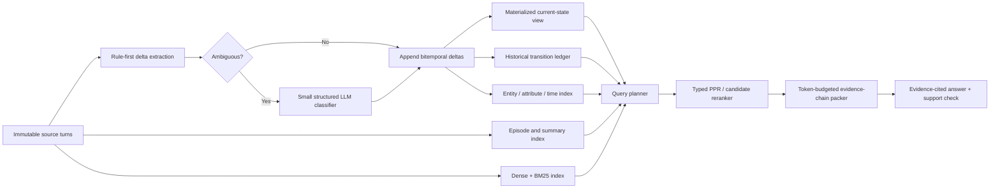

# A-MEM Deep Artifact Audit and Research Roadmap

Date: 2026-08-21

Primary artifact: `outputs/amem_test_gemini-2.5-flash/20260821_023755`

> **Scope notice:** this report audits query-policy variation on one all-feature memory build. It should not be used as the primary evidence for construction-feature effects. For the six independent 2026-08-16–17 builds, see [`AMEM_INDEPENDENT_BUILD_AUDIT_AND_RESEARCH_ROADMAP_20260822.md`](AMEM_INDEPENDENT_BUILD_AUDIT_AND_RESEARCH_ROADMAP_20260822.md).

Scope: the repository's `amem`, `amem_fix`, and `amem_test` implementations; all documentation under `docs/`; the source memory build; the root evaluation; all 20 fixed-snapshot query runs; persisted retrieval, answer, judge, usage, batch, and audit records; related local memory systems; and relevant long-term-memory and retrieval literature.

## Executive assessment

The latest artifact is the most extensively instrumented A-MEM experimental package found in this repository because it combines a complete five-unit/50-session snapshot, detailed build telemetry, retrieval audits, and four query-time configurations repeated five times each. It supports several useful conclusions, but it does **not** establish that typed relations, temporal state, provenance, or original evolution improve answer accuracy.

The most defensible findings are:

1. **The source memory is an all-feature build, not a typed-only build.** Its effective combination is `base_memory+original_evolution+typed_relations+temporal_state+provenance`. The saved description saying “without original evolution” is wrong.
2. **The 20 child runs are four query configurations with five repeats each on one frozen snapshot.** This is a substantial methodological improvement over independently rebuilding memory, but retrieval is still not frozen: the keyword LLM is called again on every repeat.
3. **Untyped link retrieval has the best repeated mean in this artifact:** `0.600 ± 0.033` binary accuracy and `0.627 ± 0.032` average score. Typed-only retrieval averages `0.551`, typed plus temporal `0.547`, and typed plus raw provenance `0.584`. Every exploratory paired bootstrap interval includes zero, so none of these differences is established as causal.
4. **The observed configurations have different category profiles.** Untyped-link retrieval has 16/25 correct state-update outcomes versus 5/25 for typed-edge expansion; temporal traversal/order has 0/20 correct multi-hop outcomes; provenance records plus raw-turn injection have 8/20. These are small-category final-answer results, not supporting-evidence retrieval measurements.
5. **Retrieval itself remains stochastic at temperature zero.** Mean pairwise seed-set Jaccard similarity is only `0.823–0.836` across the repeated groups. Exact answer strings vary on `30–35` of 49 questions within each supposedly identical group.
6. **Construction is extremely expensive and has a high retry burden.** The build used 11.0 million tokens, 3,524 successful calls, 6,961 attempts, and about 14.1 hours of measured build wall time. The tracker classified 3,437 attempts (`49.4%`) as failed/retried.
7. **Original evolution is the primary build-cost target.** It consumed 7.46 million tokens and 33,846 seconds—about 68% of build tokens and 67% of feature wall time—without retaining an inspectable per-memory evolution history.
8. **Provenance and temporal bookkeeping are cheap; their upstream inference is not.** Provenance attachment and temporal transitions are local and take less than one second combined. Relation inference costs 2.96 million tokens and 10,826 seconds.
9. **Evidence selection is a high-priority hypothesis, not a proven bottleneck.** The current graph performs fixed-priority breadth-first expansion from semantic seeds. It does not rank expanded evidence against the question, preserve evidence chains under a token budget, or directly index entities, attributes, and valid-time intervals. Gold evidence labels are required before attributing failures to selection.
10. **A replayable state-delta layer is one plausible structural direction, not established novelty.** Immutable source turns could feed a bitemporal claim/state ledger, hybrid candidate retrieval, query-conditioned graph ranking, and complete evidence-chain packing. This overlaps temporal context-graph work and must be compared against simpler ledgers and Graphiti/Zep-style baselines. Original evolution should separately be tested as a selective rather than universal operation.

The latest evidence therefore supports a narrower and stronger research claim than “typed memory improves A-MEM”:

> On a frozen longitudinal memory snapshot, retrieval policy and evidence assembly materially change performance and cost, but fixed typed BFS is not consistently better than broad untyped links. Query-conditioned, state-aware, token-budgeted evidence selection is the next mechanism that should be tested.

This is a forensic audit and experimental roadmap for one Persona 1 subset, not evidence of a new performant or efficient method. There are no gold supporting-turn labels, matched context-token ablations, human-adjudicated judge results, cross-persona replications, or matched external baselines in the audited artifact. MedMemoryBench dialogue and answers are benchmark data, not validated clinical evidence; benchmark improvements must not be interpreted as medical validity, safety, calibration, or suitability for clinical decision support.

## 1. Method identity: terminology that should be used

The repository contains three different methods whose names can otherwise lead to invalid comparisons.

| Name | Correct research label | Memory write path | Query path | Main caveat |
|---|---|---|---|---|
| `amem` | **Raw benchmark A-MEM adapter** | Stores large token-bounded formatted chunks | Direct semantic top-$k$ | Not aligned with the released paper evaluator's atomic-note/query flow despite comments that call it “official” |
| `amem_fix` | **Paper-aligned practical A-MEM baseline** | Stores one timestamped atomic note per dialogue turn and runs original evolution | LLM keyword query, semantic seeds, untyped link expansion | Expensive, broad expansion, position-compatible links |
| `amem_test` | **Experimental A-MEM framework** | Uses the atomic path plus configurable evolution, typed relations, temporal state, and provenance | Any combination of links, typed expansion, temporal selection, and evidence injection | A method name does not identify one algorithm; the full build and retrieval feature vector is required |

The historical raw `amem` score of `43/97` is not an original-paper A-MEM result. It differs from `amem_fix` in note granularity, embedding setup, retrieval count, query rewriting, and link expansion. It should be retained as a raw adapter baseline, not cited as evidence for or against the paper method.

The latest source run is also not “typed only.” Its effective build is:

```text
base memory
+ original evolution
+ typed relations
+ temporal state
+ provenance
```

Every child query condition uses that same all-feature memory. A child with typed retrieval disabled is therefore **not** an `amem_fix` build; it is untyped-link retrieval over an all-feature `amem_test` snapshot.

## 2. Evidence base and audit method

### 2.1 Artifacts inspected

- Source run configuration, result, answers, build report, logs, checkpoints, batch manifests, and memory manifest.
- All five cumulative memory snapshots and embedding sidecars under `memory/`.
- All 20 child directories under `query_runs/`, including 245 query records per configuration group and 980 across all child runs.
- All 49 query records per child, including retrieved memories and the embedded `retrieval_audit` object.
- The active A-MEM adapters and robust/typed memory layers.
- A-MEM tests for atomic notes, typed relations, temporal state, provenance, snapshots, append, retry, batch scope, and API-failure separation.
- Existing AMEM reports and implementation guides under `docs/`.
- Relevant local adapters and vendored systems including BM25, dense RAG, HippoRAG, LightMem, Mem0, MemOS, MemRL, MIRIX, REMem, Letta, Zep, Graph RAG, and Self-RAG.
- Literature and official repositories listed in the references.

### 2.2 Statistical treatment

- Each query group contains five repeated runs on the same memory build.
- Reported standard deviations are population standard deviations across the five run-level results.
- Exploratory paired bootstrap intervals resample the 49 query IDs after averaging each query over its five repeats.
- These are descriptive query-resampling intervals conditional on the five observed executions per query. They do not incorporate additional retrieval, answer-model, judge-model, provider, or batch-scheduling variance and are not population-level causal confidence intervals.
- Exact answer-string differences are used only as a nondeterminism indicator, not as a semantic disagreement metric.

### 2.3 Important limitation of the repeated design

The memory snapshot is fixed, but the retrieval prompt is not. `AMemFixAgent._generate_retrieval_query()` calls the memory LLM for every query execution. Thus each repeat contains three stochastic layers:

```text
keyword generation and retrieval
        -> final answer generation
        -> LLM judging
```

The five repeats estimate the variance of the entire query-and-evaluation pipeline, not answer-model variance alone.

## 3. Artifact integrity and configuration audit

### 3.1 Source identity

All 20 child runs point to:

- source run: `20260821_023755`;
- build ID: `3ed8da80-b766-4a9d-8ea1-8a751f8f1236`;
- build config hash: `21c89b46414f775b`;
- context/persona: Persona 1;
- completed units: 5;
- stored sessions: 50;
- final entries: 788;
- final serialized state: 19,692,268 bytes (`18.780 MiB`).

This lineage is a major strength. It makes the child comparisons substantially cleaner than comparisons among independently rebuilt graphs.

### 3.2 Misleading description

The persisted method description says:

> Typed-relation A-MEM without original evolution or untyped link retrieval

The effective source build has all four experimental build features enabled. The root retrieval also enabled untyped links, typed retrieval, temporal retrieval/order, and raw provenance. The current YAML at `configs/method_config/persona_1/amem_test2_gemini_50.yaml` reflects the last query mode rather than the original root invocation.

Consequences:

- filenames and free-text descriptions cannot be trusted as experimental labels;
- the effective config in `run_config.json` and `memory/manifest.json` is authoritative;
- mutable reuse of one config path weakens command-level reproducibility even though each invocation persists its resolved configuration.

Future runs should use immutable, content-addressed experiment specifications or include the retrieval combination ID in the child directory metadata.

### 3.3 Coverage

Every child query run is complete for its declared 49-query subset:

- expected: 49;
- scored: 49;
- omitted: 0;
- terminal API failures: 0.

The root all-stage result instead reports:

- expected: 97;
- scored: 49;
- omitted: 48;
- coverage: `0.505`;
- `complete: false`.

The root `32/49` score is therefore not a full 97-query Persona 1 benchmark result. The 20 child runs intentionally evaluate the same first-50-session subset and are valid paired subset experiments, but none resolves the full-coverage limitation.

## 4. Memory-build audit

### 4.1 Final structure

| Object | Count |
|---|---:|
| Atomic notes | 788 |
| Typed directed edges | 816 |
| Ordinary link-list entries | 2,983 |
| Relation audits | 788 |
| Temporal audit records | 243 |
| Applied temporal transitions | 237 |
| Rejected transitions | 6 |
| Current states | 775 |
| Superseded states | 13 |
| Evidence records | 788 |
| Evidence-bearing memories | 788 |
| Provenance audit errors | 0 |

Typed edge distribution:

| Relation | Count | Share |
|---|---:|---:|
| `SUPPORT` | 391 | 47.9% |
| `REFINE` | 209 | 25.6% |
| `RELATED` | 187 | 22.9% |
| `SUPERSEDE` | 17 | 2.1% |
| `CONFLICT` | 12 | 1.5% |

Only 29 of 816 edges are explicit `SUPERSEDE` or `CONFLICT` relations. Whether this density is sufficient for current-state resolution is unmeasured and requires relation-level and state-replay evaluation.

### 4.2 Build cost

| Feature | Successful calls | Attempts | Failed/retried attempts | Tokens | Wall time |
|---|---:|---:|---:|---:|---:|
| Base note analysis | 788 | 1,262 | 474 | 603,228 | 6,033 s |
| Original evolution | 1,949 | 4,084 | 2,135 | 7,459,209 | 33,846 s |
| Typed relation inference | 787 | 1,615 | 828 | 2,956,812 | 10,826 s |
| Embedding/indexing | 0 LLM | 0 | 0 | 0 | 100 s |
| Temporal state | 0 LLM | 0 | 0 | 0 | 0.13 s |
| Provenance | 0 LLM | 0 | 0 | 0 | 0.48 s |
| **Total** | **3,524** | **6,961** | **3,437** | **11,019,249** | **50,814 s** |

Key cost ratios:

- original evolution: 67.7% of build tokens and 66.6% of feature wall time;
- typed relations: 26.8% of build tokens and 21.3% of feature wall time;
- base analysis: 5.5% of build tokens;
- provenance plus temporal bookkeeping: negligible direct cost.

This produces a clear efficiency recommendation: **retain immutable provenance and inexpensive temporal bookkeeping, but make evolution and relation inference selective.** Removing provenance to save build cost would target the wrong component.

### 4.3 Retry burden and unit volatility

The tracker classifies 3,437 of 6,961 attempts as failed/retried (`49.4%`). This can include provider, empty-output, or malformed-output failures; the artifact does not preserve a complete category breakdown for these internal calls.

Build wall time by ten-session unit is highly variable:

| Unit | New notes | Wall time |
|---:|---:|---:|
| 0 | 152 | 9,682 s |
| 1 | 160 | 8,867 s |
| 2 | 160 | 8,816 s |
| 3 | 160 | 17,489 s |
| 4 | 156 | 5,959 s |

Unit 3 takes 2.94 times as long as unit 4 for a similar number of notes. Model calls and retries, not local temporal/provenance operations, dominate reproducibility and cost.

An instrumentation gap remains: build `failure_duration_seconds` is zero despite thousands of failed attempts. Retry sleep, provider failure latency, and successful-call latency should be reported separately.

### 4.4 Evolution is not replayable

Original evolution is invoked on every note and successfully makes 1,949 calls, but every persisted note has an empty `evolution_history`. The code mutates old note contexts and tags without appending a revision event.

This does not prove that evolution had no effect. It proves that its effect cannot be reconstructed from the final artifact. A research system should preserve:

- note ID;
- previous and new values;
- triggering source note;
- operation type;
- model/prompt version;
- confidence or parser status;
- timestamp;
- index generation updated by the mutation.

Without this ledger, the most expensive feature cannot be audited at the memory level.

### 4.5 Potential stale retrieval state

Original evolution can mutate old notes' contexts and tags. The retriever is rebuilt only at consolidation thresholds. Between consolidations, the in-memory note and its indexed document can disagree.

This creates a potential index-consistency risk because:

- semantic retrieval and relation-candidate search can use stale metadata;
- the serialized note can look correct while the embedding corresponds to an older state;
- downstream typed relations are inferred from candidates selected through the stale index.

The code path establishes the risk, but the current artifact does not quantify whether it changed any retrieved result.

A minimum fix is dirty-note tracking with immediate or checkpointed re-embedding. Every retrieval audit should include an index generation and dirty-note count.

### 4.6 Relation construction limits

Typed relation construction has four structural ceilings:

1. Candidate recall is limited to five semantic neighbors.
2. Candidate content is truncated before relation classification.
3. Edges are generated only when a new note is inserted; there is no global backfill or graph repair pass.
4. Edge deduplication uses `(source_id, target_id)`, so a pair cannot preserve multiple relation assertions or later revisions.

The graph is therefore an insertion-time sparse hypothesis graph, not a complete or calibrated knowledge graph.

### 4.7 Temporal-state limits

Temporal state derives from only `SUPERSEDE`, `REFINE`, and `CONFLICT` edges. It is useful audit metadata, but it is not a proposition-level state model:

- a note can contain multiple attributes with different validity;
- `REFINE` does not identify which field was refined;
- a conflict can reflect a true update, source disagreement, scope difference, or extraction error;
- event time and observation/recording time are not first-class separate fields;
- relative-time queries are anchored to selected memories rather than a known conversation clock;
- parsing the full multiple-choice question can interpret a distractor date as the target.

The ten temporal audit records with nonempty error fields, including multiple-superseder cases, demonstrate that these ambiguities are active rather than hypothetical.

### 4.8 Provenance strengths and limits

Provenance is the most structurally reliable construction audit feature in this artifact:

- 788 memories map to 788 content-addressed evidence records;
- evidence IDs are deterministic hashes of canonical source metadata and raw text;
- no provenance errors are recorded;
- source session, turn, timestamp, speaker, role, and raw text are retained.

Limits:

- chunked parts retain source-turn provenance, not exact character/token spans;
- raw evidence can duplicate the atomic note;
- evidence is capped by count rather than token cost or marginal utility;
- provenance is useful only if the selector retrieves the right memory first.

## 5. The 20 fixed-snapshot query runs

### 5.1 Experimental groups

All groups use the same all-feature snapshot, final answer model, judge, temperatures, and nominal retrieval budgets.

| Short label | Full policy label | Runs | Query-time behavior |
|---|---|---:|---|
| G1 links | Untyped-link retrieval on the all-feature snapshot | 5 | 10 semantic seeds plus broad untyped link expansion; typed, temporal, and provenance retrieval off |
| G2 typed | Typed-edge expansion on the all-feature snapshot | 5 | 10 semantic seeds plus 10 typed BFS additions; links, temporal, and provenance retrieval off |
| G3 temporal | Typed expansion plus temporal traversal-and-ordering | 5 | G2 plus temporal-state traversal/order and up to 5 temporal additions |
| G4 provenance | Typed expansion plus provenance records and raw-turn injection | 5 | G2 plus up to 10 provenance records with raw source injection; temporal retrieval/order off |

Comparability:

- G2 to G3 is the cleanest configuration-level contrast, but it is not a frozen-evidence comparison because retrieval keywords, seed sets, prompts, answers, and judgments are regenerated.
- G2 to G4 adds both provenance metadata and raw source text.
- G1 to G2 replaces one expansion policy with another; it is not “typed on versus off” at fixed context size.
- G3 to G4 simultaneously removes temporal retrieval and adds raw provenance, so it is confounded.

### 5.2 Aggregate repeated results

| Group | Binary accuracy mean ± SD | Average score mean ± SD | Mean memories | Mean recorded query-phase tokens/run | Mean batch-inclusive run elapsed time |
|---|---:|---:|---:|---:|---:|
| G1 links policy | **0.600 ± 0.033** | **0.627 ± 0.032** | 30.93 | 836,185 | 716 s |
| G2 typed policy | 0.551 ± 0.026 | 0.569 ± 0.026 | 19.96 | 614,913 | 634 s |
| G3 temporal policy | 0.547 ± 0.020 | 0.577 ± 0.012 | 23.00 | 751,320 | 781 s |
| G4 provenance policy | 0.584 ± 0.028 | 0.604 ± 0.023 | 19.98 | 877,937 | 868 s |

The run token totals include query rewriting, final answers, and judging. Each child has 137 successful calls, consistent with 49 keyword generations, 49 final answers, and 39 LLM judgments. The current usage schema groups all of them into `query_phase`; it does not preserve a separate judge phase in these artifacts. The elapsed time includes batch waiting, provider scheduling, retries, and fallbacks; it is not online retrieval or per-query serving latency.

Descriptive efficiency trade-offs:

- G2 uses 26.5% fewer end-to-end recorded query-phase tokens than G1 but loses 4.9 binary-accuracy points and 5.8 average-score points in the observed means.
- G3 uses 10.1% fewer recorded query-phase tokens than G1 but loses 5.3 binary-accuracy points in the observed means.
- G4 uses 5.0% more recorded query-phase tokens and more batch-inclusive elapsed time than G1 while scoring lower on average.

G1 has an observed Pareto advantage over G4 on mean score, recorded tokens, and batch-inclusive elapsed time in this sample. This is not a confirmed population effect or an isolated mechanism comparison.

### 5.3 Per-type repeated results

Values are mean scores over five repeats. Per run, EEM/TLA/MQ/IG have 10 questions, SUA has 5, and MCD has 4; the small SUA/MCD denominators make one-answer flips large.

| Type | G1 links | G2 typed | G3 typed + temporal | G4 typed + raw provenance |
|---|---:|---:|---:|---:|
| Entity exact match | **0.940** | 0.800 | 0.820 | 0.780 |
| Temporal localization | 0.760 | 0.780 | 0.800 | **0.900** |
| State update | **0.640** | 0.200 | 0.280 | 0.240 |
| Multiple choice | **0.777** | 0.747 | 0.747 | 0.727 |
| Inference generation | 0.180 | 0.280 | **0.320** | 0.280 |
| Multi-hop clinical deduction | 0.234 | 0.205 | 0.000 | **0.378** |

The observed policies do not have one uniform category profile:

- G1 has higher observed state-update and exact-entity means.
- G3 has a slightly higher temporal-localization mean than G2 but 0/20 aggregate MCD correctness.
- G4 has the highest observed MCD final-score mean but lower exact-answer means; supporting-evidence recall was not measured.
- G2/G3 have higher observed inference-generation means than G1, but absolute IG performance remains poor.

### 5.4 Exploratory paired uncertainty

Paired mean-score deltas use query-level means across the five repeats and bootstrap the 49 query IDs.

| Comparison | Mean delta | Exploratory 95% interval | Query wins / ties / losses |
|---|---:|---:|---:|
| G2 typed − G1 links | `-0.057` | `[-0.160, +0.037]` | 8 / 32 / 9 |
| G3 temporal − G2 typed | `+0.008` | `[-0.048, +0.063]` | 8 / 33 / 8 |
| G4 provenance − G2 typed | `+0.035` | `[-0.010, +0.085]` | 9 / 33 / 7 |
| G4 provenance − G3 temporal | `+0.027` | `[-0.036, +0.098]` | 10 / 29 / 10 |

All intervals cross zero. The correct conclusion is “configuration-sensitive with hypotheses for type-specific effects,” not “feature X wins.” A hierarchical repeat/query analysis is required to incorporate more than query-composition uncertainty.

### 5.5 Retrieval and answer instability

Despite a fixed memory snapshot and temperature-zero configuration:

| Group | Mean seed-set Jaccard | Mean final-set Jaccard | Queries with >1 exact answer | Queries with score variance |
|---|---:|---:|---:|---:|
| G1 links | 0.834 | 0.863 | 30/49 | 11/49 |
| G2 typed | 0.836 | 0.843 | 34/49 | 10/49 |
| G3 temporal | 0.823 | 0.831 | 35/49 | 11/49 |
| G4 provenance | 0.826 | 0.821 | 35/49 | 13/49 |

For G4, the lowest per-question **mean of the ten within-group pairwise** seed-set Jaccards is `0.267`; the lowest individual pairwise seed-set Jaccard is `0.0526`. These are not five executions over identical evidence. Keyword-generation variability changes the semantic seeds, after which graph traversal can amplify the change.

This is the most important design correction for the next experiment: **cache and freeze the retrieval query, semantic scores, selected IDs, and final prompt before repeating answer generation.**

### 5.6 Context and artifact inflation

| Group | Mean relation-context characters | Mean raw-evidence characters/query | Mean answer-artifact size |
|---|---:|---:|---:|
| G1 links | n/a | 0 | 3.94 MiB |
| G2 typed | 46,199 | 0 | 6.92 MiB |
| G3 temporal | 55,759 | 0 | 13.10 MiB |
| G4 provenance | 64,741 | 15,869 | 10.44 MiB |

G3 artifacts are especially large because temporal state and retrieval audit data are repeated inside records. The first retrieved-memory record stores the complete relation-aware context in addition to the per-memory fields. This is useful for forensic analysis but inefficient as a long-term experiment format.

Persist query audit, prompt text/hash, and per-memory records as separate normalized objects or sidecars rather than nesting one full audit in the first memory record.

### 5.7 Query retries

All child runs eventually complete, but attempt-level failure remains material:

| Group | Mean attempts | Mean failed/retried attempts | Attempt failure rate |
|---|---:|---:|---:|
| G1 links | 168.2 | 31.2 | 18.5% |
| G2 typed | 154.2 | 17.2 | 11.2% |
| G3 temporal | 160.0 | 23.0 | 14.4% |
| G4 provenance | 159.2 | 22.2 | 13.9% |

Terminal API-failure count is zero, which demonstrates effective retry/fallback handling. It does not mean the executions were operationally deterministic or cheap.

## 6. Query-type failure analysis

### 6.1 Entity exact match

EEM is generally strong, but metric semantics are inconsistent.

Examples include:

- expected `Diabetes`, output `Type 2 diabetes`: medically compatible but rejected by one judge as too specific;
- expected value interpreted as blood pH, output includes `mmol/L`: rejected because the unit changes the meaning;
- plain string EEM and `EEM_judge` disagree in both directions across artifacts.

These are a mixture of retrieval/generation errors and evaluator ontology errors. EEM reporting should include:

- normalized exact match;
- judge result;
- disagreement rate;
- manual adjudication for disagreement cases.

### 6.2 Temporal localization

TLA has the highest non-exact category scores. G4 obtains `9/10` in every repeat despite temporal retrieval being disabled, while G3 ranges from `7/10` to `9/10`. This is compatible with the hypothesis that raw source evidence can help temporal answering, but the regenerated seeds and prompts prevent attributing the difference to evidence injection.

Observed failures include answering that no March event exists when the relevant historical symptom is present elsewhere in memory. The current temporal feature can fail in three places:

1. the right event never enters the semantic seed set;
2. state traversal has no edge path to it;
3. ordering promotes a recent but irrelevant state.

A direct normalized timestamp/entity index is needed before graph traversal.

### 6.3 State update

State update is the clearest failure of typed-only retrieval:

- G1 links: `0.640`;
- G2 typed: `0.200`;
- G3 temporal: `0.280`;
- G4 provenance: `0.240`.

Representative errors select an older diet, glucose, medication, or symptom state; confuse a high-glucose episode with an earlier low; or describe an implied medication stop without stating the requested current status.

The result suggests that broad untyped links preserve more longitudinal context than the sparse typed graph. It does not show that untyped links model state correctly. A proposition-level state ledger is needed so “latest,” “previous,” and “changed” are resolved before prose generation.

### 6.4 Multiple choice

MQ is deterministic at scoring time and relatively stable. Typical failures choose an extra option, omit a valid option, or retrieve evidence from the wrong episode. Examples include:

- output `A,B,D`, expected `A,B`;
- output `B`, expected `B,C`;
- output `C,D`, expected `B,D`.

This category is useful for isolating retrieval and answer-selection effects because it removes judge variance. It should be a primary sanity-check endpoint for query-policy experiments.

### 6.5 Inference generation

IG remains weak in every group (`0.18–0.32`). Judge rationales repeatedly identify:

- generic advice instead of patient-specific reasoning;
- failure to distinguish old from current medication state;
- omission of mechanism or urgency;
- acceptance of false symptomatic improvement;
- incomplete or truncated responses.

Relevant evidence is often present. Increasing graph expansion alone is unlikely to solve IG. The answer stage needs an evidence-to-claim plan, current-state projection, and support verification.

### 6.6 Multi-hop clinical deduction

MCD most clearly motivates retrieval-chain measurement:

- G3 typed plus temporal: 0/20 aggregate correct outcomes across five runs;
- G4 typed plus raw provenance: 8/20 aggregate correct outcomes, versus 4/20 for G2 and 5/20 for G1;
- judge retrieval labels improve from mostly `none` to `partial` or `excellent` for several G4 cases;
- node mention can improve without causal-relation correctness.

These final scores and judge labels motivate the hypothesis that retrieval-chain availability differs. They do not prove that temporal expansion removed evidence or that raw provenance improved supporting-turn recall: keywords, seeds, prompts, answers, and judgments were regenerated, and no gold chain annotations exist.

MCD should be evaluated as a chain:

```text
required source nodes retrieved
        -> required transitions/relations present
        -> nodes mentioned in answer
        -> causal links stated correctly
        -> final conclusion correct
```

The current final score collapses these stages into one outcome.

## 7. Strengths of the current research platform

### 7.1 Strong engineering foundations

- Atomic timestamped turns in `amem_fix`/`amem_test` are appropriate for longitudinal dialogue.
- Snapshot manifests preserve build identity, state, embeddings, and source lineage.
- Build and retrieval configurations are separated, enabling fixed-snapshot query ablations.
- Child runs preserve resolved configurations even when the YAML file is later changed.
- Batch manifests preserve request/response identity and retries.
- API failures are separated from scored incorrect answers.
- Usage telemetry distinguishes base analysis, evolution, typed relations, temporal state, provenance, and embeddings.
- Provenance is complete, immutable, and content-addressed.
- Typed relations use stable memory IDs even though ordinary links retain integer compatibility.
- Retrieval audit contains selected IDs, expansion origins, relations, temporal states, and evidence.

### 7.2 Empirical strengths

- All 20 child runs have complete 49-query coverage.
- EEM and TLA are generally strong.
- G1's higher observed state-update mean makes broad linked retrieval a useful longitudinal-context baseline.
- G4's higher observed aggregate MCD final score makes exact source-turn injection a candidate for controlled supporting-evidence tests.
- The repeated design directly reveals nondeterminism that one-run comparisons conceal.
- The build telemetry makes cost reduction a measurable research objective rather than an anecdotal one.

## 8. Prioritized limitations

### P0: experimental validity

1. Only 49 of the full 97 Persona 1 queries are evaluated.
2. Query rewriting, retrieval, answering, and judging all vary inside each repeat.
3. Current groups do not use a matched final token budget.
4. G1 versus G2 changes expansion type and context size simultaneously.
5. G3 versus G4 changes temporal and provenance behavior simultaneously.
6. The mutable config filename and incorrect description can mislabel artifacts.
7. No independent human or repeated-judge adjudication accompanies the latest run.

### P0: retrieval correctness

8. Semantic search does not persist similarity scores or rank margins.
9. Keyword generation is uncached and changes seeds across repeats.
10. Original evolution can leave embeddings stale.
11. Ordinary links still accept positional integers.
12. Typed graph expansion is fixed-priority BFS, not query-aware ranking.
13. Relation candidates are limited to five dense neighbors.
14. Final evidence is bounded by memory count, not token utility.
15. Complete evidence chains are not protected from truncation or middle placement.

### P1: memory semantics

16. Typed edge storage is pair-deduplicated rather than assertion/multi-label based.
17. LLM confidence is uncalibrated.
18. State is assigned to whole notes rather than normalized propositions.
19. Event time and observation time are not separated.
20. Conflict, scope difference, and true update can be conflated.
21. Original evolution has no persisted revision history.
22. Near-duplicate patient/doctor restatements are retained without explicit canonicalization.

### P1: efficiency and reliability

23. Original evolution consumes about two-thirds of build cost.
24. Typed relation inference runs for almost every note.
25. Internal calls are sequential and have a 49.4% retry ratio in this build.
26. Metadata, relation, and keyword outputs are not content-addressed caches.
27. Query artifacts repeat large contexts and audit structures.
28. Query timing remains `0.0` in answer summaries despite 10–15 minutes of run wall time.

### P2: evaluation scope

29. Supporting-memory recall is not measured against source labels.
30. Judge, answer, and retrieval error are not separated systematically.
31. LoCoMo lacks the same mature fixed-snapshot protocol.
32. No cross-persona or full-dataset replication is available.
33. Cost is reported, but no Pareto or selective-risk analysis is used.

## 9. Related work: mechanisms that transfer

| Work | Verified mechanism | Transferable lesson | Caution |
|---|---|---|---|
| A-MEM | Structured notes, dynamic linking, memory evolution | Preserve adaptive organization as the baseline concept | The repository's raw `amem` is not the paper flow |
| HippoRAG / HippoRAG 2 | Dense/graph integration and personalized PageRank | Replace fixed BFS with query-seeded graph diffusion | Graph quality and extraction recall remain prerequisites |
| LongMemEval | Indexing/retrieval/reading decomposition; knowledge update and temporal evaluation | Report stage-specific failure and use time-aware query expansion | Different dataset distribution |
| LoCoMo | Single-hop, temporal, multi-hop, open-domain conversational memory | Cross-dataset validation | Category accuracy still does not identify retrieval failure |
| Graphiti/Zep | Temporal facts, validity intervals, episodes, provenance, hybrid retrieval | Separate source episodes from evolving facts and valid time | Current public repository behavior is fast-moving and infrastructure-heavy |
| Mem0 | Explicit `ADD/UPDATE/DELETE/NONE` memory actions | Test a selective write policy instead of universal evolution | Direct code path and service claims should not be conflated |
| LightMem | Event/fact separation, timestamp normalization, deferred updates | Normalize time and move expensive consolidation offline | Full buffering architecture changes the task and cost model |
| REMem | Fact/entity/episodic/gist channels and graph traversal | Test representation diversity one channel at a time | Full graph rebuild is not an incremental A-MEM ablation |
| RAPTOR | Hierarchical summaries at multiple abstraction levels | Retrieve event/session summaries before opening exact turns | Abstractive summaries can erase temporal or negation details |
| RECOMP / LLMLingua | Query-conditioned compression and selective augmentation | Pack only useful evidence under a token budget | Medical values, negation, and dates must be span-protected |
| RAGChecker | Retrieval- and generation-specific diagnostics | Evaluate evidence recall, context precision, and faithfulness separately | Automatic graders require calibration |
| Lost in the Middle | Long-context use depends on evidence position | Control evidence ordering and test position sensitivity | Effect size is model/context dependent |
| Self-RAG / CRAG | Selective retrieval and retrieval-quality checks | Add answerability/support gates | Self-graders can be miscalibrated and add cost |

The local repository already contains BM25, dense RAG, HippoRAG, LightMem, Mem0, MemOS, MemRL, MIRIX, REMem, Letta, Zep, Graph RAG, and Self-RAG implementations or adapters. For A-MEM research, their concepts should be transferred as isolated interventions rather than importing another complete memory stack.

## 10. Research contribution roadmap

### 10.1 Small changes: high-confidence foundations

| Contribution | Change | Hypothesis | Cost impact | Required ablation |
|---|---|---|---|---|
| Frozen retrieval replay | Cache retrieval query, scores, IDs, final context, and prompt hash | Removing retrieval variance will make answer/judge variance measurable | Reduces 49 keyword calls per repeat | Replayed versus regenerated retrieval |
| Stable index contract | Make stable IDs canonical and reindex dirty notes | Rank and link correctness improve after evolution | Small extra embedding work | Immediate versus threshold consolidation |
| Query audit v2 | Persist scores, origins, tokens, truncation, finish reason, latency, and prompt hash | Failures can be assigned to retrieval, packing, answer, or judge | Storage increase; normalized sidecars reduce duplication | Audit completeness test |
| Hybrid dense + BM25 | Fuse dense and lexical candidates with reciprocal-rank fusion | Exact entities, dates, labs, and medications improve | Local retrieval only | Dense, BM25, and fused at equal final budget |
| Token-budgeted MMR | Select complete evidence blocks by relevance, novelty, and cost | Equal or better accuracy with fewer tokens | Reduces final prompt cost | Count budget versus token budget |
| Direct temporal index | Normalize source timestamps and index `(entity, date)` | TLA/SUA recall improves independently of graph edges | Local index cost | Graph temporal traversal versus direct index |
| Question-stem parsing | Exclude answer options from temporal intent parsing | Fewer distractor-date errors | Negligible | Full question versus stem only |
| Provenance metadata-only mode | Keep citations but inject raw text only when useful | Auditability remains while prompt cost falls | Large token saving versus G4 | Metadata, selected spans, full raw turns |

### 10.2 Medium changes: algorithmic contributions

#### A. Query-conditioned hybrid evidence ranker

Create a unified candidate pool from:

- dense semantic retrieval;
- BM25;
- entity/attribute overlap;
- direct timestamp matches;
- one-hop typed neighbors;
- untyped links.

Score each memory $m$ for query $q$:

$$
S(m,q)=w_d S_{dense}+w_s S_{sparse}+w_e S_{entity}+w_t S_{time}
       +w_g S_{graph}+w_p S_{provenance}-w_h S_{historical\ mismatch}.
$$

Then choose complete blocks under token budget $B$:

$$
\max_{A \subseteq C}\sum_{m\in A}S(m,q)
-\lambda\,\mathrm{Redundancy}(A)
\quad\text{s.t.}\quad
\sum_{m\in A}\mathrm{tokens}(m)\le B.
$$

Start with deterministic weights and MMR. A local cross-encoder can be added only after the score-only baseline is measured.

#### B. Typed personalized PageRank

Replace BFS expansion with query-seeded relation diffusion:

$$
r^{(0)}=s,\qquad
r^{(k+1)}=(1-\alpha)s+\alpha P_q^\top r^{(k)},\qquad 0<\alpha<1,
$$

where $s$ is a normalized fused seed distribution and $P_q$ is a query-conditioned row-stochastic transition matrix weighted by relation type, edge reliability, temporal compatibility, and query intent.

- current-state query: prefer valid `SUPERSEDE`/`REFINE` paths and penalize superseded states;
- explanatory query: prefer `SUPPORT` and `REFINE`;
- conflict query: retain competing `CONFLICT` branches;
- multi-hop query: preserve connected evidence chains rather than isolated top notes.

Compare fixed BFS, untyped PPR, typed PPR, and hybrid non-graph retrieval at the same final token budget.

#### C. Multi-assertion relation ledger

Replace pair-only edges with immutable relation assertions:

```text
(source_id, target_id, relation_type, asserted_at,
 valid_interval, confidence, evidence_ids, model_version)
```

Allow multiple labels, later corrections, and calibrated reliability. Keep zero-confidence/rejected predictions in audit storage but out of the active graph.

#### D. Selective write policy

Adapt the useful part of Mem0's write policy to A-MEM:

```text
ADD | CONFIRM | REFINE | SUPERSEDE | CONFLICT | NONE
```

Deterministic rules should handle explicit dates, numbers, medication start/stop language, and exact repeated facts. Invoke an LLM only for ambiguous candidates. Preserve source evidence regardless of the derived action.

This directly targets the 7.46-million-token evolution cost.

#### E. Hierarchical event memory

Maintain three levels:

1. immutable source turns;
2. event/session summaries with exact evidence links;
3. current and historical state projections.

Retrieve summaries for broad inference and open their source turns only when selected. Never allow a summary to replace the evidence layer.

### 10.3 Efficiency contributions

#### Selective evolution gate

Before original evolution, compute cheap novelty/change signals:

- dense similarity and margin;
- lexical/entity overlap;
- normalized attribute/value differences;
- negation and temporal update markers;
- current-state conflict.

Skip evolution for redundant acknowledgments and paraphrases. Send only ambiguous or high-impact notes to an LLM.

Target success criteria:

- at least 60% fewer evolution calls;
- no statistically meaningful loss in supporting-memory recall;
- fewer duplicate notes and lower final footprint;
- preserved or improved SUA/MCD performance.

#### Content-addressed operation cache

Cache:

- metadata analysis by source-content and prompt/model hash;
- relation inference by new-note hash plus ordered candidate hashes;
- keyword queries by question and prompt/model hash;
- reranking by query-candidate hash;
- judge results by answer/reference/rubric/model hash.

This improves cost, replayability, and debugging. Cache hits must be reported rather than counted as new model calls.

#### Safe concurrency and batch construction

- analyze independent turns concurrently within a bounded semaphore;
- batch relation inference after metadata extraction;
- preserve deterministic insertion/order IDs;
- apply state transitions in source-time order after parallel inference;
- record queue, provider, retry, and backoff time separately.

#### Compact artifacts

Move large fields into content-addressed sidecars:

- prompts and relation-aware contexts;
- raw relation responses;
- evidence text;
- per-query audits.

Result JSON should reference hashes/paths. This removes repeated megabytes without sacrificing auditability.

## 11. Proposed new method: State-Delta A-MEM

### 11.1 Motivation

The current system asks a note graph to solve three different problems:

1. retrieve relevant episodes;
2. determine the current or historical value of an attribute;
3. assemble a causal explanation.

Generic note links are useful for (1) and sometimes (3), but they are an indirect and fragile mechanism for (2). A medical dialogue contains updates such as medication start/stop, value increase/decrease, symptom appearance/resolution, and diagnosis confirmation. These should be represented as replayable state operations rather than inferred only as edges between long prose notes.

### 11.2 Core representation

State-Delta A-MEM retains the immutable source turn and derives zero or more claim deltas:

$$
d=(subject, attribute, operation, value,
        [t_{valid\_start},t_{valid\_end}),t_{ingested},
        scope,confidence,evidence).
$$

Operations include:

```text
SET, ADD, STOP, INCREASE, DECREASE,
NEGATE, CONFIRM, REFINE, SUPERSEDE, DISPUTE
```

Each delta is append-only. The half-open valid-time interval records when the claim applies in the dialogue, while immutable ingestion time records when the memory system observed it. Current state is a materialized view produced by replay, not destructive mutation. Competing deltas form a conflict bundle rather than forcing one timeless fact.

### 11.3 Architecture



### 11.4 Query compiler

Map a question to a plan:

```text
intent: factual | current | historical | change | conflict | causal | multi-hop
entities/attributes: normalized query targets
time: interval or relative reference
channels: dense | sparse | state | temporal | graph | episode
required evidence: single fact | transition pair | conflict bundle | causal chain
```

Examples:

- “What medication is the patient taking now?” → current-state projection plus supporting latest delta.
- “What was the fasting glucose in March?” → historical value filtered by valid time.
- “How did treatment change?” → ordered transition chain.
- “Why did the doctor suspect oral therapy failure?” → causal graph seeded by the relevant state changes and exact source evidence.

### 11.5 Why this is different from the current typed graph

| Current `amem_test` | State-Delta A-MEM |
|---|---|
| Whole notes receive temporal status | Individual normalized claims/deltas have validity |
| Evolution mutates note metadata | Source and deltas are append-only; views are replayable |
| `SUPERSEDE` is an LLM edge between notes | Update operations apply to a normalized attribute/scope |
| Current state depends on graph traversal | Current state is a materialized projection |
| One relation per ordered pair | Multiple versioned assertions are retained |
| BFS expansion | Query-planned hybrid retrieval and relation diffusion |
| Count-bounded concatenation | Complete evidence-chain packing under token budget |

### 11.6 Research positioning

State-Delta A-MEM is a task-specific hypothesis: adapting replayable claim deltas and evidence-chain packing to longitudinal medical dialogue may improve state-update and multi-hop retrieval under a controlled cost budget. Temporal facts, validity windows, source episodes, hybrid retrieval, and incremental graph updates already appear in Graphiti/Zep and related temporal-memory systems. Any novelty must therefore be demonstrated against those systems and against simpler append-only ledgers, dense/BM25 retrieval, and non-graph hybrid reranking. The contribution cannot be claimed from this roadmap alone.

### 11.7 Main risks

- entity/attribute normalization can merge distinct concepts;
- incomplete dates and anaphora can create uncertain intervals;
- extraction can over-structure narrative information;
- a state projection can appear authoritative even when sources disagree;
- medical conversational state is not clinical ground truth.

Mitigations:

- preserve raw episodes and uncertainty;
- never physically delete superseded evidence;
- keep conflict bundles;
- expose source citations;
- allow an `unknown/ambiguous` state;
- evaluate extraction and state replay separately from answer quality.

## 12. Paper-quality experimental program

### Phase 0: make the existing experiment causal

1. Build or extend one Persona 1 snapshot through all sessions required for all 97 queries.
2. Persist immutable config content and source hashes.
3. Generate one retrieval-query string per question and cache it.
4. Persist semantic candidate IDs and scores.
5. Use the same final context-token budget for every condition.
6. Freeze each final prompt before answer repeats.
7. Run at least three answers per frozen prompt.
8. Rejudge saved answers independently; manually adjudicate judge disagreements.
9. Report complete coverage and failures.

### Phase 1: retrieval-policy matrix on the current graph

| Condition | Dense | BM25/entity | Untyped links | Typed graph | Temporal index/order | Raw evidence |
|---|---:|---:|---:|---:|---:|---:|
| A | yes | no | no | no | no | no |
| B | yes | yes | no | no | no | no |
| C | yes | no | yes | no | no | no |
| D | yes | no | no | BFS | no | no |
| E | yes | yes | no | BFS | no | no |
| F | yes | yes | no | typed PPR | no | no |
| G | yes | yes | no | typed PPR | direct index + annotation | no |
| H | yes | yes | no | typed PPR | direct index + annotation | selected spans |

Run each at memory-context budgets of 4k, 8k, and 16k tokens. This reveals whether gains come from retrieval policy or simply more context.

### Phase 2: evidence annotation and mediation

Create a stratified source-evidence audit set containing at minimum:

- all 4 MCD questions;
- all 5 SUA questions;
- all 10 TLA questions;
- all changed/flipped questions across the 20 runs;
- a balanced sample of EEM, MQ, and IG.

For each question label:

- minimum supporting turns;
- required temporal/state transitions;
- required causal nodes and edges;
- distractor turns;
- acceptable answer variants.

Primary retrieval metrics:

- supporting-turn Recall@$k$;
- evidence-set recall;
- MRR/nDCG of supporting memories;
- transition-chain recall;
- unsupported context rate;
- duplicate context rate;
- evidence recall per 1,000 prompt tokens.

Use mediation logic:

```text
algorithm changes evidence recall?
        -> evidence recall changes answer correctness?
        -> answer correctness survives independent judging?
```

### Phase 3: construction interventions

Compare on identical source sessions:

1. original evolution;
2. no evolution;
3. novelty-gated evolution;
4. rule-first selective write policy;
5. rule-first plus ambiguous-case LLM;
6. state-delta ledger.

Report:

- build calls/tokens/time;
- retries and fallback rate;
- duplicate note rate;
- relation/state extraction precision and recall;
- index freshness;
- snapshot size;
- retrieval evidence metrics;
- final answer metrics.

### Phase 4: transfer

After a mechanism wins on full Persona 1:

1. test additional MedMemoryBench personas without retuning;
2. add the same fixed-snapshot protocol to LoCoMo;
3. evaluate LongMemEval-style update, temporal, and abstention capabilities if data integration is feasible;
4. compare against BM25, dense RAG, HippoRAG, and `amem_fix` with matched answer models and budgets.

## 13. Metrics and statistical reporting

### Build

- notes and derived claims per source turn;
- duplicate/near-duplicate rate;
- calls, attempts, retries, fallback parses, and failure categories;
- tokens and latency by operation;
- relation candidate recall and accepted-edge precision;
- temporal/state transition accuracy;
- provenance coverage and span precision;
- dirty index count and consolidation latency;
- snapshot JSON, embedding, audit, and total size.

### Retrieval

- raw and rewritten query;
- candidate IDs, stable scores, rank margins, and channels;
- graph paths and edge reliability;
- temporal plan and direct index hits;
- selected evidence blocks and token cost;
- records dropped by reranking or budget;
- exact prompt hash and prompt tokens;
- retrieval wall time.

### Answer and judge

- answer output, tokens, finish reason, and truncation;
- cited evidence IDs;
- unsupported-claim rate;
- answer-repeat agreement;
- judge-repeat agreement;
- human/judge disagreement;
- API and parser failures;
- selective risk/coverage if abstention is added.

### Statistics

- paired per-query deltas;
- bootstrap confidence intervals clustered by query;
- random effects or hierarchical variance decomposition for retrieval/answer/judge repeats;
- per-type results with denominators;
- full coverage and coverage-adjusted outcomes;
- Pareto plots for quality versus build/query tokens and latency;
- no best-of-five selection as the primary result.

## 14. Immediate next actions

### Before another expensive build

1. Correct the misleading description in the AMEM config or stop using descriptions as labels.
2. Freeze/copy the current 20 resolved configs under immutable experiment IDs.
3. Extract a normalized CSV/Parquet table from the 20 child artifacts.
4. Add retrieval query, scores, context tokens, finish reason, and local timing to persisted query audit.
5. Cache keyword generation.
6. Add supporting-turn labels for all MCD/SUA/TLA questions.
7. Rejudge the saved latest answers and manually inspect disagreements; do not regenerate retrieval.

### First implementation intervention

Implement **dense + BM25/entity fusion plus token-budgeted complete evidence packing** on the existing frozen snapshot. It is lower risk than rebuilding the graph, requires no new generative build calls, and tests the high-priority evidence-selection hypothesis raised by the artifact.

### First efficiency experiment

Implement a **novelty-gated evolution mode** and compare it with original evolution and no evolution. The current cost profile gives this experiment a clear target and potential impact; whether it constitutes a contribution depends on replicated efficiency/quality results and comparison with selective-write baselines.

### First structural contribution

Prototype **State-Delta A-MEM** only for medication, glucose/lab values, symptoms, and diagnosis/status changes. Measure delta extraction and replay accuracy before integrating it into answer generation.

## 15. Claims supported and not supported

### Supported

- The fixed all-feature snapshot is structurally complete and auditable.
- Provenance attachment is reliable in this artifact.
- Original evolution dominates build cost.
- Typed BFS is not consistently better than untyped links in the latest repeated subset.
- Retrieval and answers remain stochastic despite temperature zero.
- Different retrieval policies have large observed query-type-specific score differences in this subset.
- G3 has 0/20 aggregate MCD correctness; the artifact does not establish whether temporal retrieval caused this result or whether supporting evidence was absent.
- G4's raw-turn-injection policy has higher observed aggregate MCD final scores than G2/G3 but higher query cost; supporting-evidence recall was not measured.
- State update and inference generation remain major weaknesses.

### Not supported

- Typed relations improve overall accuracy.
- Temporal state improves overall accuracy.
- Provenance alone improves overall accuracy.
- The root `32/49` is a full benchmark result.
- G1 is equivalent to an `amem_fix` build.
- The latest run is typed-only or disables original evolution.
- Temperature zero makes retrieval, answering, or judging deterministic.
- More retrieved memories necessarily improve answers.
- The current temporal state represents clinical truth rather than conversational records.

## 16. Complete child-run table

Per-type columns are `MQ / EEM / TLA / SUA / IG / MCD` correct counts. Average score is the metric-aware score, not only binary correctness.

| Child run | Group | Correct | Accuracy | Avg score | Per-type correct | Mean memories |
|---|---|---:|---:|---:|---|---:|
| `20260821_171423` | G1 links | 27/49 | 0.551 | 0.578 | 5 / 9 / 7 / 3 / 2 / 1 | 31.10 |
| `20260821_173021` | G1 links | 29/49 | 0.592 | 0.616 | 7 / 9 / 8 / 3 / 1 / 1 | 30.84 |
| `20260821_174135` | G1 links | 30/49 | 0.612 | 0.636 | 7 / 10 / 8 / 3 / 1 / 1 | 30.84 |
| `20260821_175227` | G1 links | 32/49 | 0.653 | 0.677 | 7 / 10 / 7 / 4 / 3 / 1 | 30.92 |
| `20260821_180422` | G1 links | 29/49 | 0.592 | 0.626 | 6 / 9 / 8 / 3 / 2 / 1 | 30.98 |
| `20260821_182104` | G2 typed | 29/49 | 0.592 | 0.605 | 7 / 8 / 8 / 1 / 4 / 1 | 19.94 |
| `20260821_183147` | G2 typed | 26/49 | 0.531 | 0.546 | 7 / 8 / 7 / 1 / 2 / 1 | 20.00 |
| `20260821_184129` | G2 typed | 28/49 | 0.571 | 0.595 | 6 / 8 / 9 / 1 / 3 / 1 | 20.00 |
| `20260821_185224` | G2 typed | 26/49 | 0.531 | 0.554 | 6 / 8 / 8 / 1 / 3 / 0 | 19.94 |
| `20260821_190324` | G2 typed | 26/49 | 0.531 | 0.544 | 7 / 8 / 7 / 1 / 2 / 1 | 19.94 |
| `20260821_193715` | G3 temporal | 27/49 | 0.551 | 0.575 | 6 / 8 / 8 / 1 / 4 / 0 | 23.02 |
| `20260821_194929` | G3 temporal | 25/49 | 0.510 | 0.558 | 5 / 8 / 9 / 1 / 2 / 0 | 22.88 |
| `20260821_200122` | G3 temporal | 28/49 | 0.571 | 0.595 | 7 / 9 / 7 / 1 / 4 / 0 | 23.02 |
| `20260821_201424` | G3 temporal | 27/49 | 0.551 | 0.575 | 6 / 8 / 8 / 2 / 3 / 0 | 23.06 |
| `20260821_202552` | G3 temporal | 27/49 | 0.551 | 0.582 | 6 / 8 / 8 / 2 / 3 / 0 | 23.00 |
| `20260821_204736` | G4 provenance | 30/49 | 0.612 | 0.626 | 7 / 8 / 9 / 1 / 3 / 2 | 19.94 |
| `20260821_210340` | G4 provenance | 30/49 | 0.612 | 0.630 | 7 / 8 / 9 / 2 / 2 / 2 | 19.94 |
| `20260821_211739` | G4 provenance | 27/49 | 0.551 | 0.578 | 6 / 8 / 9 / 1 / 1 / 2 | 20.00 |
| `20260821_213042` | G4 provenance | 29/49 | 0.592 | 0.609 | 5 / 8 / 9 / 1 / 4 / 2 | 20.00 |
| `20260821_214719` | G4 provenance | 27/49 | 0.551 | 0.575 | 6 / 7 / 9 / 1 / 4 / 0 | 20.00 |

## 17. Primary repository references

- Shared raw adapter: `methods/amem_agent.py`
- Paper-aligned practical adapter: `methods/amem_fix_agent.py`
- Experimental adapter: `methods/amem_test_agent.py`
- Robust memory layer: `methods/amem/A-mem/memory_layer_robust.py`
- Typed/temporal/provenance layer: `methods/amem/A-mem/memory_layer_typed.py`
- Latest source config: `outputs/amem_test_gemini-2.5-flash/20260821_023755/run_config.json`
- Latest memory manifest: `outputs/amem_test_gemini-2.5-flash/20260821_023755/memory/manifest.json`
- Latest root result: `outputs/amem_test_gemini-2.5-flash/20260821_023755/medmemorybench_amem_test_gemini-2.5-flash_20260821_170341_result.json`
- Repeated query runs: `outputs/amem_test_gemini-2.5-flash/20260821_023755/query_runs/`
- Previous comprehensive report: `docs/AMEM_NEXT_EXPERIMENTS_REPORT.md`
- Build telemetry schema: `docs/AMEM_BUILD_METRICS.md`

## 18. Literature and official project references

1. Xu et al. **A-MEM: Agentic Memory for LLM Agents.** NeurIPS 2025. [arXiv:2502.12110](https://arxiv.org/abs/2502.12110), [evaluation code](https://github.com/WujiangXu/A-mem), [system code](https://github.com/WujiangXu/A-mem-sys).
2. Gutiérrez et al. **HippoRAG: Neurobiologically Inspired Long-Term Memory for Large Language Models.** NeurIPS 2024. [arXiv:2405.14831](https://arxiv.org/abs/2405.14831), [code](https://github.com/OSU-NLP-Group/HippoRAG).
3. Gutiérrez et al. **From RAG to Memory: Non-Parametric Continual Learning for Large Language Models (HippoRAG 2).** ICML 2025. [arXiv:2502.14802](https://arxiv.org/abs/2502.14802).
4. Wu et al. **LongMemEval: Benchmarking Chat Assistants on Long-Term Interactive Memory.** ICLR 2025. [arXiv:2410.10813](https://arxiv.org/abs/2410.10813), [code](https://github.com/xiaowu0162/LongMemEval).
5. Maharana et al. **Evaluating Very Long-Term Conversational Memory of LLM Agents (LoCoMo).** 2024. [arXiv:2402.17753](https://arxiv.org/abs/2402.17753), [code](https://github.com/snap-research/locomo).
6. Ru et al. **RAGChecker: A Fine-grained Framework for Diagnosing Retrieval-Augmented Generation.** 2024. [arXiv:2408.08067](https://arxiv.org/abs/2408.08067), [code](https://github.com/amazon-science/RAGChecker).
7. Sarthi et al. **RAPTOR: Recursive Abstractive Processing for Tree-Organized Retrieval.** 2024. [arXiv:2401.18059](https://arxiv.org/abs/2401.18059).
8. Xu et al. **RECOMP: Improving Retrieval-Augmented LMs with Compression and Selective Augmentation.** 2023. [arXiv:2310.04408](https://arxiv.org/abs/2310.04408).
9. Liu et al. **Lost in the Middle: How Language Models Use Long Contexts.** TACL 2023. [arXiv:2307.03172](https://arxiv.org/abs/2307.03172).
10. Park et al. **Generative Agents: Interactive Simulacra of Human Behavior.** 2023. [arXiv:2304.03442](https://arxiv.org/abs/2304.03442).
11. Asai et al. **Self-RAG: Learning to Retrieve, Generate, and Critique through Self-Reflection.** 2023. [arXiv:2310.11511](https://arxiv.org/abs/2310.11511).
12. Yan et al. **Corrective Retrieval Augmented Generation.** 2024. [arXiv:2401.15884](https://arxiv.org/abs/2401.15884).
13. Patil et al. **RAFT: Adapting Language Model to Domain Specific RAG.** 2024. [arXiv:2403.10131](https://arxiv.org/abs/2403.10131).
14. Zep/Graphiti. **Temporal context graph implementation and documentation.** [Graphiti repository](https://github.com/getzep/graphiti), [Zep paper: arXiv:2501.13956](https://arxiv.org/abs/2501.13956). Repository feature claims should be treated as implementation documentation, not independent benchmark evidence.
15. Chhikara et al. **Mem0: Building Production-Ready AI Agents with Scalable Long-Term Memory.** 2025 preprint. [arXiv:2504.19413](https://arxiv.org/abs/2504.19413), [official repository](https://github.com/mem0ai/mem0).
16. Fang et al. **LightMem: Lightweight and Efficient Memory-Augmented Generation.** ICLR 2026. [arXiv:2510.18866](https://arxiv.org/abs/2510.18866), [official repository](https://github.com/zjunlp/LightMem). Event/fact and offline-update details cited in this report are also grounded in the inspected local implementation and repository documentation.
17. Shu et al. **REMem: Reasoning with Episodic Memory in Language Agent.** ICLR 2026. [arXiv:2602.13530](https://arxiv.org/abs/2602.13530), [official repository](https://github.com/intuit-ai-research/REMem). Representation/retrieval details cited here are grounded in the inspected local implementation and repository documentation.

## Final recommendation

Do not spend the next large budget on another all-feature rebuild. Use the current frozen snapshot to establish a deterministic retrieval replay, supporting-evidence labels, matched token budgets, and stage-separated variance. Then test the smallest intervention for the evidence-selection hypothesis: hybrid candidate retrieval plus query-aware, token-budgeted evidence-chain selection.

In parallel, test selective original evolution. If a structural method is pursued, evaluate State-Delta A-MEM as a replayable bitemporal layer over immutable turns rather than adding more note-level relation labels. It becomes a research contribution only if controlled experiments show replicated quality or efficiency gains over simpler and closest temporal-memory baselines.