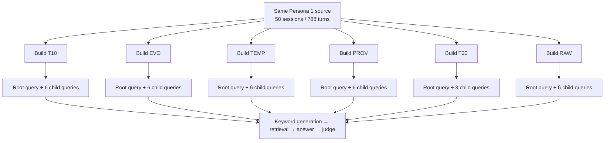
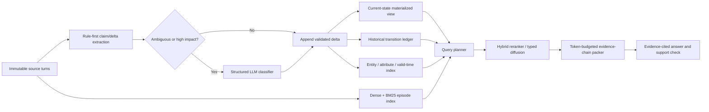

# A-MEM Independent-Build Audit and Research Roadmap

Date: 2026-08-22

Primary artifacts:

- `outputs/amem_test_gemini-2.5-flash/20260816_014759`
- `outputs/amem_test_gemini-2.5-flash/20260816_014953`
- `outputs/amem_test_gemini-2.5-flash/20260816_111258`
- `outputs/amem_test_gemini-2.5-flash/20260816_111502`
- `outputs/amem_test_gemini-2.5-flash/20260817_011704`
- `outputs/amem_test_gemini-2.5-flash/20260817_022709`

Scope: the six independently constructed Persona 1 memory snapshots, their root evaluations, all 33 available child query runs, serialized note/graph/state/provenance data, build and query resource use, active A-MEM implementation, existing repository reports, and relevant long-term-memory and retrieval research.

This report supersedes the build-feature interpretation in `AMEM_NEXT_EXPERIMENTS_REPORT.md`. It complements rather than replaces `AMEM_DEEP_AUDIT_AND_RESEARCH_ROADMAP_20260821.md`, which analyzes query policies on one later all-feature snapshot.

For the later completed hybrid-retrieval, graph-ranking, fixed-BFS, and chain-selection run matrix, see [`AMEM_COMPLETED_RUNS_RESULTS_20260823.md`](AMEM_COMPLETED_RUNS_RESULTS_20260823.md).

## Executive assessment

The 2026-08-16–17 artifacts are the primary evidence for comparing construction variants of this repository's experimental `amem_test` adapter. They are not a replication of the A-MEM paper's original evaluator or a direct estimate of the paper's reported method. Each root has its own five-unit memory build, build ID, configuration hash, embedding sidecars, graph realization, and root query execution. The child directories then reload that root's serialized snapshot and repeat the query pipeline.

This design is stronger than comparing filenames or query-only runs from one all-feature snapshot, but it is still not a causal feature experiment. EVO, TEMP, PROV, and RAW each have one independent build. T10 and T20 are two independent builds with the same typed-only construction flags but different query expansion budgets; their graphs also differ. Child query runs replicate query execution, not memory construction. Several configuration pairs change more than one mechanism.

The most defensible findings are:

1. **The six roots are genuinely separate memory builds.** All have distinct build IDs and configuration hashes, five cumulative snapshots, 50 source sessions, and 788 atomic notes.
2. **Only 49 of the expected 97 Persona 1 questions are scored.** Every root and child has complete coverage of that declared 49-question subset and zero terminal API failures, but each result correctly reports overall benchmark coverage as `49/97 = 0.505` and `complete: false`.
3. **No construction feature has a demonstrated accuracy advantage.** Child-only mean accuracies range from `0.537` to `0.595`, but every selected question-resampling interval crosses zero, and each configuration has only one build realization.
4. **The highest observed child-only mean belongs to RAW:** `0.595 ± 0.030` accuracy and `0.589 ± 0.029` average score over six child runs. RAW injects source-turn text that can duplicate information already present in the structured atomic note. This is not a provenance effect: the build also uses a different typed graph and zero typed-relation inference temperature.
5. **Typed expansion 20 is second descriptively:** `0.578 ± 0.024` accuracy over only three children. It cannot be cleanly compared with expansion 10 because the two roots use independently generated graphs.
6. **Original evolution plus untyped links has the highest observed state-update count:** `17/30`, versus `9/30` for T10 and `9/30` for TEMP. This is a descriptive category result from one EVO build, not evidence that evolution improves state-update accuracy.
7. **TEMP does not show a higher observed temporal-localization count than T10.** TEMP obtains `44/60` child TLA outcomes, versus `48/60` for T10. This does not test whether temporal state is sufficient because TEMP changes temporal construction/query behavior and graph realization simultaneously.
8. **EVO is the clearest observed efficiency liability.** Its five unit-level construction records sum to 7.82 million tracker-reported tokens, 2,699 successful build-call requests, and 24,706 seconds of measured construction time. The typed builds use approximately 3.59–3.60 million tokens, 1,575 successful requests, and 13,248–16,659 measured seconds. These are not end-to-end root-process wall times.
9. **Memory construction is materially stochastic.** The 788 source-note contents and timestamps align exactly across builds, but extracted contexts never match exactly against the typed-10 build, keywords match for only 11–16 notes, and tags match for only 0–39 notes. Across typed graphs, edge-pair Jaccard is `0.693–0.736`; among shared pairs, relation-label agreement is only `0.651–0.687`.
10. **Query execution is also materially stochastic.** Exact answers change for 33–40 of 49 questions in the root-inclusive families. RAW has higher observed retrieval-membership stability (`31/49` questions changed versus `47–49/49` for most other families), but this cannot be attributed to temperature because RAW also changes graph realization and raw evidence formatting. The comparison additionally mixes one in-process root query with separately reloaded child queries.
11. **The strongest immediate contribution is experimental control.** Freeze keyword queries, semantic scores, seed IDs, context blocks, answer prompts, and saved answers; then vary retrieval, answering, and judging one stage at a time.
12. **The strongest efficiency hypothesis is selective evolution and relation inference.** The highest-cost generative operations should be gated by deterministic novelty, entity/value-change, contradiction, and temporal-update signals.
13. **The strongest structural hypothesis remains a replayable claim/state layer with hybrid retrieval and chain-preserving evidence selection.** It is not established novelty and must be compared with simpler ledgers, Mem0-style write policies, LightMem-style deferred updates, REMem-style episodic channels, and Graphiti/Zep-style temporal graphs.

The strongest defensible research statement is therefore:

> On the Persona 1 49-question subset, independently constructed A-MEM configurations differ substantially in cost, graph realization, context assembly, category profile, and repeated-query stability. The current one-build-per-configuration design does not identify a causal benefit from typed relations, temporal state, provenance, raw evidence, expansion count, or original evolution.

MedMemoryBench is a benchmark of conversational memory, not clinical validation. None of these artifacts establishes medical correctness, safety, calibration, diagnosis quality, treatment quality, or suitability for clinical use.

## 1. Experimental lineage and units of replication

### 1.1 Two nested experimental levels



There are two distinct replication units:

- **Build unit:** one independently constructed memory snapshot. This is the required unit for claims about construction features.
- **Query-execution unit:** a repeated execution against one fixed snapshot. This estimates conditional retrieval/answer/judge variability, not build variability.

The dataset contains:

- 6 independent roots/builds;
- 6 root query executions;
- 33 child query executions;
- 39 total observed query executions;
- 49 questions per execution;
- 1,617 child query records and 1,911 root-inclusive query records.

The root is an observed post-build query executed in the original `stage=all` process. Each child is a separate `stage=query` process that reloads the serialized snapshot identified by `memory_source.json`. Root and child results therefore differ in both query realization and execution path; roots are reported separately and are not treated as interchangeable fixed-snapshot repeats or additional memory builds.

### 1.2 Correct unit for each claim

| Claim | Required unit | Available here? |
|---|---|---|
| This snapshot is internally complete | Snapshot/integrity record | Yes |
| This query pipeline is variable on a fixed snapshot | Query repeats within snapshot | Yes |
| This build is more expensive than that observed build | Build artifact | Descriptively, yes |
| Feature X generally improves memory construction | Independent builds within each feature condition | No; mostly one per condition |
| Feature X improves retrieval evidence recall | Gold supporting evidence plus paired retrieval | No |
| Feature X improves medical reasoning | Build replication, validated evidence, and expert evaluation | No |

### 1.3 Coverage

All root and child result files report:

```text
expected_queries = 97
scored_queries = 49
omitted_queries = 48
api_failed_queries = 0
api_failure_events = 0
coverage = 0.5051546391752577
complete = false
```

Thus:

- each run is operationally complete for its configured first-50-session query subset;
- none is a complete 97-question Persona 1 benchmark result;
- all reported scores must be labeled **Persona 1, 49-question subset**.

## 2. Effective configurations

Archived `run_config.json` and serialized `experimental_features` are authoritative. Current YAML files have changed since these runs and should not be used to reconstruct historical conditions.

| Label | Root | Build features | Query behavior | Build ID | Config hash |
|---|---|---|---|---|---|
| **T10** | `20260816_014759` | Typed relations; original evolution off; temporal state off; provenance off | 10 semantic seeds + up to 10 typed additions | `a30e730c-f945-46e7-a7eb-0d70689f142e` | `d0c30b653ff4241c` |
| **EVO** | `20260816_014953` | Original evolution on; typed, temporal, provenance off | 10 semantic seeds + broad ordinary-link expansion | `ca88e7b7-cd2f-46ed-95f8-b589b9172a2f` | `0f11a509cdf33382` |
| **TEMP** | `20260816_111258` | Typed relations + temporal state | Typed expansion 10 + temporal traversal/order + up to 5 temporal additions | `62834de3-0ba6-496e-bf21-6d962d1e7bd8` | `1abae33e453b1644` |
| **PROV** | `20260816_111502` | Typed relations + provenance | Typed expansion 10 + provenance metadata; raw text off | `e97fa07b-5efd-4447-990a-b9ba87f01f57` | `7cba19dfcf21f4e2` |
| **T20** | `20260817_011704` | Same construction family as T10 | 10 semantic seeds + up to 20 typed additions | `7a14dd8f-1a95-41ea-9a78-e02996ae9bad` | `5f4e5af28b9ebb9d` |
| **RAW** | `20260817_022709` | Typed relations + provenance; explicit zero relation temperature | Typed expansion 10 + provenance metadata + raw source-turn injection | `c9aec5d6-dbe6-4e44-8e36-be3c0ed971bb` | `d9f732c34830d44d` |

Common settings:

- Vertex `gemini-2.5-flash` answer and memory model;
- local `all-MiniLM-L6-v2` embeddings;
- 10 semantic seeds;
- 5 relation candidates per inserted note;
- relation confidence threshold `0.5`;
- LLM keyword generation enabled;
- 50 Persona 1 sessions in five ten-session units;
- no injected benchmark noise.

Important confounds:

- T10 uses typed-only construction with original evolution off, whereas EVO enables original evolution and ordinary-link retrieval. The comparison changes construction, graph type, query expansion, context count, and cost.
- T10 versus TEMP changes both the independently generated typed graph and temporal construction/query behavior.
- T10 versus PROV changes the independently generated graph and provenance context.
- Typed expansion count is a query-time factor and does not alter edge construction. However, T10 and T20 were built independently, so their graph realizations differ. They provide limited evidence about repeated typed-only construction but cannot identify the expansion-budget effect without crossing both policies over both snapshots.
- PROV versus RAW changes raw source-turn injection, the independently generated relation graph, and typed-relation inference temperature (`0.2` versus `0.0`). The archived final-answer and judge temperatures are zero in both runs.
- There is no semantic-only/base construction root in this group.

## 3. Artifact integrity and construction structure

### 3.1 Integrity strengths

All 30 snapshot JSON files passed the stored integrity-hash check:

- 6 builds × 5 cumulative units;
- build ID and configuration hash match each manifest;
- every unit covers ten source sessions;
- all typed-relation endpoints resolve;
- both provenance builds have valid evidence hashes and no dangling references;
- every child `memory_source.json` explicitly points to its parent build.

Every build stores exactly:

- 50 sessions;
- 5 memory units;
- 788 atomic notes;
- identical aligned source-note content and timestamps;
- identical embedding sidecar dimensions and total embedding size.

This is a strong foundation for future controlled work.

### 3.2 Final memory structures

Counts are from cumulative `memory/persona_1_unit_4.json`, not sums across units.

| Build | Notes | Ordinary links | Typed edges | Temporal states | Evidence records | Evolution processing counter (`evo_cnt`) |
|---|---:|---:|---:|---:|---:|---:|
| T10 | 788 | 0 | 814 | 0 | 0 | 0 |
| EVO | 788 | 2,981 | 0 | 0 | 0 | 784 |
| TEMP | 788 | 0 | 811 | 788 | 0 | 0 |
| PROV | 788 | 0 | 825 | 0 | 788 | 0 |
| T20 | 788 | 0 | 814 | 0 | 0 | 0 |
| RAW | 788 | 0 | 812 | 0 | 788 | 0 |

TEMP state details:

- 779 notes marked current;
- 9 notes marked superseded;
- 224 temporal audit records;
- state transitions are derived only from `SUPERSEDE`, `REFINE`, and `CONFLICT` edges.

Provenance details:

- PROV and RAW each contain 788 provenance-bearing notes and 788 content-addressed evidence records;
- every note references one valid evidence ID;
- no provenance hash or dangling-reference failures were found.

In EVO, `evo_cnt=784` is an implementation counter for truthy evolution-processing outcomes, not a count of verified mutations. Because `evolution_history` is empty and no before/after field deltas are persisted, the number and identity of actual applied mutations cannot be reconstructed.

### 3.3 Typed-edge composition

| Build | `CONFLICT` | `REFINE` | `RELATED` | `SUPERSEDE` | `SUPPORT` | Total |
|---|---:|---:|---:|---:|---:|---:|
| T10 | 19 | 209 | 171 | 13 | 402 | 814 |
| TEMP | 14 | 195 | 168 | 9 | 425 | 811 |
| PROV | 14 | 186 | 185 | 9 | 431 | 825 |
| T20 | 13 | 185 | 169 | 16 | 431 | 814 |
| RAW | 11 | 194 | 171 | 15 | 421 | 812 |

Edge count alone is misleading: graph realization and labels differ even when total counts are similar.

### 3.4 Build-to-build memory stochasticity

The notes align by insertion order because all 788 source contents and timestamps are identical across roots. Against T10:

| Field | Exact matches out of 788 |
|---|---:|
| Source content | 788 for every build |
| Timestamp | 788 for every build |
| Category | 788 for every build |
| Importance score | 788 for every build |
| Extracted context | 0 for every other build |
| Keywords | 11–16 |
| Tags | 0–39 |

This shows that the source segmentation is controlled while generative metadata is not reproducible.

For typed graphs, endpoints were converted from run-specific memory IDs to aligned note positions before comparison:

| Graph pair | Edge-pair Jaccard | Shared endpoint pairs | Same relation label on shared pairs | Typed-triple Jaccard |
|---|---:|---:|---:|---:|
| T10–TEMP | 0.736 | 689 | 0.679 | 0.404 |
| T10–PROV | 0.693 | 671 | 0.651 | 0.364 |
| T10–T20 | 0.734 | 689 | 0.678 | 0.402 |
| T10–RAW | 0.721 | 681 | 0.687 | 0.404 |
| TEMP–PROV | 0.722 | 686 | 0.668 | 0.389 |
| TEMP–T20 | 0.718 | 679 | 0.676 | 0.394 |
| TEMP–RAW | 0.730 | 685 | 0.669 | 0.393 |
| PROV–T20 | 0.711 | 681 | 0.656 | 0.375 |
| PROV–RAW | 0.727 | 689 | 0.675 | 0.397 |
| T20–RAW | 0.719 | 680 | 0.681 | 0.398 |

Even T10 and T20—the closest construction quasi-replicates—share only 689 endpoint pairs, and only 67.8% of those shared pairs have the same label. This is direct evidence that build realization is a major experimental variable.

### 3.5 Representation limitations

The current typed graph is an insertion-time sparse hypothesis graph:

1. Each new note considers at most five dense-retrieval candidate neighbors; recall against an annotated relation set is unmeasured.
2. Candidate text is truncated before relation inference.
3. There is no global repair/backfill pass.
4. Edges are pair-deduplicated by `(source_id, target_id)` and cannot retain multiple relation assertions or revisions for a pair.
5. Relation confidence is LLM-generated and uncalibrated.
6. No independently annotated edge set exists.

Temporal state is note-level rather than proposition-level. A single turn can contain several attributes with different valid times, while the implementation assigns one state to the whole note. Event time and ingestion/observation time are not represented as separate first-class fields.

Original evolution can mutate old contexts and tags, but persisted `evolution_history` is empty in all notes, including EVO. This does not prove that evolution had no effect; it proves that its mutations cannot be replayed or audited from the final state.

## 4. Construction efficiency

### 4.1 Root build resources

| Build | Sum of unit-level measured construction time | Tracker-reported construction tokens | Successful build-call requests | Root query-phase tokens | Total root tokens | Total successful calls |
|---|---:|---:|---:|---:|---:|---:|
| T10 | 15,394 s | 3,593,741 | 1,575 | 618,668 | 4,212,409 | 1,702 |
| EVO | 24,706 s | 7,824,937 | 2,699 | 863,542 | 8,688,479 | 2,826 |
| TEMP | 16,579 s | 3,601,258 | 1,575 | 762,596 | 4,363,854 | 1,702 |
| PROV | 16,659 s | 3,597,290 | 1,575 | 672,513 | 4,269,803 | 1,702 |
| T20 | 13,932 s | 3,589,109 | 1,575 | 945,485 | 4,534,594 | 1,702 |
| RAW | 13,248 s | 3,603,349 | 1,575 | 898,163 | 4,501,512 | 1,702 |

Observed EVO overhead relative to T10:

- 2.18× tracker-reported construction tokens;
- 1.71× successful build-call requests;
- 1.61× summed unit-level measured construction time.

The typed builds cluster tightly at approximately 3.59–3.60 million tracker-reported construction tokens and exactly 1,575 successful build-call requests. Their summed unit-level construction times still vary by 3,411 seconds, indicating operational variance beyond token count.

All call and token values in these old aggregate result files are tracker-reported successful-request totals. They do not provide complete billing-level accounting for failed attempts, retries, or tokens consumed before a failed response.

Provenance and temporal state do not add successful LLM calls in these old aggregates. Their direct bookkeeping is local; typed relation inference remains the generative construction cost. This does not mean they are free: they increase serialized state and can increase query context.

### 4.2 Snapshot footprint

| Build | Final snapshot JSON | All files under `memory/` |
|---|---:|---:|
| T10 | 13.90 MiB | 43.60 MiB |
| EVO | 8.08 MiB | 26.24 MiB |
| TEMP | 15.04 MiB | 47.00 MiB |
| PROV | 16.50 MiB | 51.03 MiB |
| T20 | 13.91 MiB | 43.60 MiB |
| RAW | 16.49 MiB | 50.98 MiB |

Typed audit structures make the typed snapshots larger than EVO despite EVO's higher construction cost. Provenance increases the T10-like cumulative memory directory by approximately 17%. This is a storage/auditability trade-off, not an accuracy result.

### 4.3 Efficiency strengths and weaknesses

Strengths:

- all configurations converge to the same 788 atomic source units;
- embeddings are sidecars rather than duplicated JSON arrays;
- snapshot publication is atomic and integrity checked;
- provenance hashing is deterministic and local;
- query-only children reuse snapshots instead of rebuilding.

Weaknesses:

- original evolution dominates additional build cost;
- relation inference runs for nearly every new note;
- metadata, relations, and keyword queries are not content-addressed caches;
- old evolution mutations have no replay ledger;
- dirty-note re-embedding is not explicitly tracked;
- internal retries and backoff are not fully separated in these older build metrics;
- serialized query records duplicate large graph/audit structures;
- stored `query_time` is zero under batch execution and is not usable as serving latency.

## 5. Root outcomes

Root results combine one construction with its first query execution. They are useful artifact records but should not be ranked as replicated methods.

| Build | Root correct | Accuracy | Average score | Evaluation coverage |
|---|---:|---:|---:|---:|
| T10 | 31/49 | 0.633 | 0.626 | 49/97 |
| EVO | 27/49 | 0.551 | 0.551 | 49/97 |
| TEMP | 30/49 | 0.612 | 0.612 | 49/97 |
| PROV | 28/49 | 0.571 | 0.570 | 49/97 |
| T20 | 31/49 | 0.633 | 0.633 | 49/97 |
| RAW | 28/49 | 0.571 | 0.565 | 49/97 |

The root ranking differs from the separately reloaded child-query ranking. T10 and T20 have unusually high root outcomes relative to their child means, while RAW's child mean exceeds its root. This difference may reflect both query stochasticity and the in-memory versus deserialized execution path; it is another reason not to infer method quality from one root score.

## 6. Primary repeated-query results

### 6.1 Child-only aggregate results

Reported variability is the sample standard deviation across child run-level proportions. It is conditional on one realized snapshot per family.

| Build family | Children | Accuracy mean ± SD | Average score mean ± SD | Child-run mean retrieved records | Child-run mean tracker tokens | Child-run mean batch-inclusive elapsed time |
|---|---:|---:|---:|---:|---:|---:|
| T10 | 6 | 0.548 ± 0.030 | 0.545 ± 0.031 | 20.00 | 621,396 | 684 s |
| EVO | 6 | 0.554 ± 0.040 | 0.554 ± 0.040 | 32.04 | 869,793 | 719 s |
| TEMP | 6 | 0.551 ± 0.032 | 0.552 ± 0.036 | 22.84 | 765,019 | 867 s |
| PROV | 6 | 0.537 ± 0.042 | 0.537 ± 0.044 | 19.98 | 673,765 | 793 s |
| T20 | 3 | 0.578 ± 0.024 | 0.573 ± 0.021 | 30.00 | 948,758 | 747 s |
| RAW | 6 | **0.595 ± 0.030** | **0.589 ± 0.029** | 20.00 | 897,473 | 782 s |

Interpretation:

- RAW has the highest observed child mean, but also high query token use and multiple confounds.
- T20 increases retrieved records and tokens without construction-level replication sufficient to isolate expansion size.
- EVO retrieves the most records after broad link expansion and is the most expensive construction.
- PROV metadata-only has the lowest observed child mean; provenance remains valuable for auditability regardless of answer score.
- TEMP has the longest observed batch-inclusive elapsed time, but this is not online latency.

T10, EVO, TEMP, PROV, and RAW means use six children; T20 means use three. Each old child records 127 successful query-stage calls, consistent with:

```text
49 keyword-generation calls
+ 49 final-answer calls
+ 29 LLM-judge calls
= 127
```

EEM and MQ are scored locally. Query token totals are tracker-reported successful-request totals combining keyword generation, final answering, and LLM judging; they are not complete billing totals. Batch-inclusive elapsed time includes local preparation, provider scheduling, queueing, fallbacks, and retries; it is not per-query serving latency.

### 6.2 Per-category child outcomes

Raw counts aggregate all child executions. T10/EVO/TEMP/PROV/RAW have six children; T20 has three.

Category abbreviations: EEM = entity exact match; TLA = temporal localization; SUA = state update; MQ = multiple choice; IG = inference generation; MCD = multi-hop clinical deduction. EEM and MQ use local deterministic metrics; TLA, SUA, IG, and MCD use LLM-judge metrics. MCD has four records per run and also exposes a separate graded score.

| Category | T10 | EVO | TEMP | PROV | T20 | RAW |
|---|---:|---:|---:|---:|---:|---:|
| EEM | 44/60 | 42/60 | 46/60 | **49/60** | 24/30 | 48/60 |
| TLA | **48/60** | 43/60 | 44/60 | 44/60 | 24/30 | **48/60** |
| SUA | 9/30 | **17/30** | 9/30 | 10/30 | 6/15 | 15/30 |
| MQ | 40/60 | 40/60 | 40/60 | 39/60 | 18/30 | 40/60 |
| IG | 15/60 | 14/60 | **18/60** | 12/60 | **10/30** | 17/60 |
| MCD binary | 5/24 | **7/24** | 5/24 | 4/24 | 3/12 | **7/24** |
| MCD mean graded score | 0.174 | **0.280** | 0.223 | 0.164 | 0.189 | 0.220 |

Category observations, not causal effects:

- **Entity extraction is relatively strong.** PROV and RAW have high observed EEM counts, but provenance is not isolated from graph realization and query variance.
- **TEMP does not show a higher observed TLA count than T10 or RAW.** This does not test sufficiency because temporal construction/query behavior and graph realization differ.
- **State update is the clearest descriptive EVO advantage in these child records.** EVO has 17/30 observed SUA outcomes; all six EVO children answer `session_50_sua_1` correctly while every other family is 0. The mechanism and build-level reproducibility are unestablished.
- **Benchmark-scored IG outcomes are low across all configurations.** The best raw count is 18/60 for TEMP; T20 has 10/30 with half as many repeats.
- **Benchmark-scored MCD outcomes are low and variable.** EVO and RAW each obtain 7/24 binary outcomes, but their graded profiles differ and no gold evidence chain is available.

These category scores measure agreement with benchmark expectations and LLM-judge rubrics. They do not establish clinical reasoning quality, medical correctness, safety, or appropriateness of treatment advice.

### 6.3 Descriptive question-resampling contrasts

For each question, child outcomes were averaged within family. The resulting 49 paired question-level deltas were resampled with replacement for 50,000 percentile-bootstrap draws using random seed `20260822`. Wins/ties/losses also use these per-question family means. These intervals are conditional on the observed snapshots and executions; they are **not build-level feature confidence intervals**.

| Contrast | Accuracy delta | Descriptive 95% interval | Question wins / ties / losses |
|---|---:|---:|---:|
| EVO − T10 | +0.007 | [-0.078, +0.092] | 10 / 31 / 8 |
| TEMP − T10 | +0.003 | [-0.051, +0.061] | 9 / 30 / 10 |
| PROV − T10 | -0.010 | [-0.058, +0.041] | 7 / 32 / 10 |
| T20 − T10 | +0.031 | [-0.031, +0.099] | 7 / 33 / 9 |
| RAW − PROV | +0.058 | [-0.010, +0.133] | 13 / 29 / 7 |
| RAW − T10 | +0.048 | [-0.017, +0.119] | 10 / 33 / 6 |

All intervals cross zero. More importantly, even an interval excluding zero would remain conditional on one independently realized graph per configuration and would not establish a construction-feature effect.

## 7. Query and evaluation stability

### 7.1 Root-inclusive family variability

The root and all available children were compared question by question.

| Family | Exact answer changed | Judge score changed | Correctness changed | Retrieval membership set changed | Mean pairwise retrieval-set Jaccard |
|---|---:|---:|---:|---:|---:|
| T10 | 40/49 | 17/49 | 17/49 | 48/49 | 0.632 |
| EVO | 40/49 | 16/49 | 15/49 | 47/49 | 0.682 |
| TEMP | 39/49 | 23/49 | 22/49 | 48/49 | 0.644 |
| PROV | 40/49 | 22/49 | 20/49 | 49/49 | 0.634 |
| T20 | 38/49 | 11/49 | 9/49 | 48/49 | 0.647 |
| RAW | 33/49 | 12/49 | 11/49 | 31/49 | 0.888 |

These rows do not all have equal repeat counts: T20 has four root-inclusive executions; the others have seven.

RAW has higher observed root-inclusive retrieval-membership stability and fewer changed answer strings than the other families, but not determinism. This is an association with RAW's `relation_temperature=0.0`, not an estimate of a temperature effect, because RAW also changes graph realization and evidence formatting.

The stability table combines one in-process root query with separately reloaded child queries. Set Jaccard measures membership only; it does not capture rank, ordering, truncation position, or prompt placement.

### 7.2 Why temperature zero is insufficient

The final answer model temperature is zero in the archived configurations, yet the pipeline can vary at several stages:

1. keyword-generation response;
2. semantic seed set and ordering;
3. graph/temporal expansion downstream of those seeds;
4. final answer generation;
5. LLM judging;
6. retries, fallbacks, and provider version behavior.

A memory snapshot freezes notes, embeddings, graph, state, and evidence. It does **not** freeze the generated query, similarity scores, selected IDs, final prompt, answer, or judgment.

### 7.3 Systematic hard questions

Across all 33 child runs, eight questions are incorrect every time:

| Query ID | Type | Failure pattern |
|---|---|---|
| `session_20_mq_2` | MQ | safer late-night takeaway selection |
| `session_40_eem_2` | EEM | emergency urine-ketone result |
| `session_10_ig_1` | IG | whether to increase glucose-lowering medication |
| `session_20_ig_1` | IG | post-takeaway tightness/discomfort |
| `session_30_sua_1` | SUA | change in late-night eating strategy |
| `session_40_ig_2` | IG | tachycardia/dry mouth/head heaviness after late eating |
| `session_40_mcd_1` | MCD | morning visual/body immobility causal chain |
| `session_50_ig_1` | IG | reduced symptoms despite nocturnal glucose surge |

These failures span deterministic local metrics and LLM-judged categories. They are high-priority cases for supporting-turn annotation and stage-by-stage replay.

Highly configuration-sensitive cases include:

- `session_50_sua_1`: EVO 6/6; all other families 0;
- `session_50_eem_2`: T10/TEMP/PROV/RAW all high, EVO 0/6, T20 3/3;
- `session_40_sua_1`: RAW 6/6, T10/PROV/T20 0;
- `session_20_tla_2`: T10/TEMP high, EVO 0/6;
- `session_30_eem_2`: EVO/TEMP/RAW 6/6, T10 1/6.

These are useful diagnostic contrasts, but they may arise from build metadata, graph paths, keyword generation, answer phrasing, or scoring. Gold evidence is required before assigning a mechanism.

## 8. Strengths

### 8.1 Engineering strengths

- Independent roots have explicit build IDs and configuration hashes.
- Snapshots are cumulative, atomic, integrity checked, and paired with embedding sidecars.
- All child runs preserve explicit source lineage.
- Atomic timestamped notes are appropriate for longitudinal dialogue.
- Stable memory IDs are used within each typed graph.
- Typed relation, temporal transition, and provenance audits are serialized.
- Provenance evidence is complete and content-addressed in both provenance builds.
- Terminal API failures are separated from scored incorrect answers.
- Query-only replay avoids unnecessary reconstruction cost.

### 8.2 Research strengths

- The data reveal both construction and query stochasticity rather than hiding it behind one score.
- T10/T20 provide two quasi-replicates of typed-only construction, exposing graph instability.
- EVO offers a practical cost reference for original A-MEM evolution plus broad links.
- TEMP verifies that temporal state is constructed and persisted in this artifact.
- PROV/RAW prove that source traceability survives serialization.
- The six category profiles generate concrete hypotheses for state update, temporal localization, inference, and multi-hop retrieval.
- Resource artifacts enable quality–cost analysis rather than accuracy-only reporting.

## 9. Limitations and threats to validity

### P0: causal validity

1. EVO, TEMP, PROV, and RAW each have one independent build.
2. T10/T20 are two typed-only construction realizations, but their query budgets differ and their graphs are independently generated.
3. Configuration changes are bundled rather than factorial.
4. Root and children are nested in one snapshot and are not independent builds.
5. T20 has only three children; other families have six.
6. Only 49 of 97 expected questions are scored.
7. Final context token budgets are not matched.
8. Current YAML descriptions have drifted from archived effective configurations.

### P0: retrieval observability

9. Keyword generations are not cached across runs.
10. Semantic similarity scores and rank margins are not persisted in these old artifacts.
11. Gold supporting turns and acceptable evidence chains are absent.
12. Retrieval count is not a token budget.
13. Persisted record-size characters are not actual formatted prompt tokens.
14. Retrieval, answer, and judge variance are mixed in each child result.
15. Batch query timing is recorded as zero in summary fields.

### P1: construction semantics

16. Generative note metadata is highly unstable across builds.
17. Relation candidate recall is capped at five dense neighbors.
18. Relation labels are uncalibrated and only moderately reproducible.
19. Pair-only edge deduplication loses multi-label/revision history.
20. There is no global relation repair pass.
21. Evolution mutations have no persisted history.
22. Evolved notes may be temporarily stale in the embedding index between consolidations.
23. Temporal state applies to whole notes rather than normalized claims.
24. Event time and ingestion time are not separate.
25. Provenance is source-turn level rather than exact supporting-span level.

### P1: measurement validity

26. A single LLM judge is not clinical ground truth.
27. Judge repeatability is not independently measured for these exact saved answers.
28. EEM/string containment can reject valid specificity or accept misleading substrings.
29. MCD graded scores combine several reasoning dimensions.
30. No blinded human adjudication is available.
31. Model/provider version drift is uncontrolled.
32. Query categories have small denominators, especially SUA (`5` per run) and MCD (`4` per run).

### P2: external validity

33. One persona and one 50-session prefix are evaluated.
34. No LoCoMo replication uses this exact protocol.
35. No matched external memory baseline is included in this six-build set.
36. Synthetic/curated benchmark dialogue is not real clinical deployment data.
37. Accuracy does not test abstention, harmful omission, contraindication handling, or calibration.

## 10. What the six builds support and do not support

### Supported

- The six roots are separate, internally consistent memory constructions.
- Atomic source-note content and timestamps are controlled across builds.
- Generative metadata and typed graphs are substantially stochastic.
- Original evolution plus links is the most expensive observed construction.
- Provenance and temporal structures are present where configured.
- Repeated query execution remains variable on fixed snapshots.
- RAW has the highest observed child mean and highest retrieval stability in this set.
- EVO has the highest observed state-update count.
- No observed aggregate contrast is robust enough to support a causal feature claim.
- IG, SUA, and MCD contain recurring difficult questions across every configuration.

### Not supported

- Typed relations improve overall accuracy.
- Original evolution improves overall accuracy.
- Temporal state improves temporal reasoning.
- Provenance metadata improves accuracy.
- Raw source injection improves accuracy.
- Expansion 20 is better than expansion 10.
- Temperature zero makes the system deterministic.
- Six roots are six replicates of one treatment.
- Child repeats estimate build variance.
- A root `31/49` or any other root score is a full Persona 1 result.
- LLM-judge correctness establishes clinical correctness or safety.

## 11. Immediate next experiments

### Experiment 0: preserve and normalize the current evidence

Before spending new model budget:

1. Export one normalized row per query execution with build ID, child ID, question ID, type, answer, score, selected IDs, and resource use.
2. Freeze all six archived root configurations under immutable filenames.
3. Add a machine-readable experiment registry describing effective build and query factors.
4. Rejudge existing saved answers without regenerating retrieval or answers.
5. Manually adjudicate metric disagreements and medically consequential errors.

Deliverable: a reproducible analysis table and script committed separately from generated outputs.

### Experiment 1: complete coverage

Run all six existing snapshots on all 97 Persona 1 questions.

Controls:

- cached keyword query per question;
- same final answer and judge models;
- identical query prompt version;
- exact source build IDs recorded;
- zero silent omissions.

Success criterion: 97/97 scored for every snapshot, with terminal API failures reported separately.

This fixes coverage but does not provide build-level causal replication.

### Experiment 2: stage-separated replay on one snapshot

For every question:

1. generate and save one keyword query;
2. save query embedding and semantic scores;
3. freeze seed IDs;
4. freeze each policy's selected IDs and final ordering;
5. freeze exact formatted prompts and token counts;
6. repeat answers only;
7. rejudge each saved answer separately.

This decomposes variance into:

```text
retrieval variance
→ answer variance conditional on context
→ judge variance conditional on answer
```

Primary outputs:

- seed/final evidence Jaccard;
- answer flip rate;
- judge flip rate;
- correctness conditional on identical context;
- per-stage tokens and elapsed time.

### Experiment 3: crossed build × query-policy matrix

Evaluate multiple query policies on every compatible existing build rather than using one policy per root.

| Policy | Seeds | Expansion | Temporal | Provenance |
|---|---|---|---|---|
| S | Frozen semantic seeds only | None | Off | Off |
| L | Frozen semantic seeds | Ordinary links where available | Off | Off |
| T10 | Frozen semantic seeds | Typed BFS 10 where available | Off | Off |
| T20 | Frozen semantic seeds | Typed BFS 20 where available | Off | Off |
| TO | Frozen typed selection | Ordering only | On | Off |
| TX | Frozen typed selection | Traversal + ordering | On | Off |
| PM | Frozen selection | Same typed budget | Off | Metadata only |
| PR | Frozen selection | Same typed budget | Off | Raw selected spans/turns |

Use equal final context-token budgets. This tests query-policy effects conditional on each realized build and exposes build × policy interactions.

### Experiment 4: replicated construction experiment

Minimum practical conditions:

1. base atomic memory, semantic retrieval only;
2. original evolution + ordinary links;
3. typed relations;
4. typed + temporal;
5. typed + provenance;
6. all features;
7. proposed selective/hybrid method.

Requirements:

- at least 3 independent builds per condition; 5 preferred;
- all 97 questions;
- cached query rewrites and matched answer/judge protocol;
- matched query context budgets;
- build and question clustered uncertainty;
- preregistered primary endpoint and non-inferiority margin.

A defensible improvement claim should require both:

- replicated build-level quality improvement with uncertainty excluding zero;
- evidence-recall or state-replay improvement consistent with the proposed mechanism.

### Experiment 5: supporting-evidence annotation

Annotate for every question:

- acceptable answers;
- required atomic facts;
- source session/turn IDs;
- one or more minimal evidence sets;
- required temporal interval/order;
- required multi-hop chain;
- relevant distractors/conflicts;
- whether external medical knowledge is required;
- whether the dialogue underdetermines the answer.

Use two blinded annotators plus adjudication.

Then measure:

- semantic seed recall@10;
- final evidence recall/precision;
- minimal-chain recall;
- current-state correctness;
- distractor inclusion rate;
- answer correctness conditional on sufficient evidence;
- judge sensitivity/specificity against adjudicated labels.

## 12. Research contribution ladder

### 12.1 Small, high-confidence interventions

#### A. Content-addressed caches

Cache by input, prompt, model, and configuration hash:

- note metadata extraction;
- relation inference;
- keyword generation;
- retrieval/reranking;
- judging.

Expected contribution: lower cost and exact replayability. Report cache hits separately from new model calls.

#### B. Complete query audit

Persist:

- keyword string;
- query embedding hash;
- semantic scores and rank margins;
- selected IDs and origin;
- final context tokens;
- truncation;
- exact prompt hash;
- answer finish reason;
- local preparation, queue, provider, retry, and judge times.

Expected contribution: assign failures to a stage rather than a final score.

#### C. Direct entity/time index

Build deterministic indexes over normalized entities, attributes, dates, medication names, and numeric measurements. Use them alongside dense retrieval.

Hypothesis: exact values and historical/current-state questions should not depend solely on stochastic keyword generation and graph paths.

#### D. Token-budgeted evidence blocks

Replace memory-count limits with complete evidence blocks under a token budget. Preserve dates, numeric values, negation, speaker, and source citation.

Hypothesis: matched-budget comparisons will reduce context inflation without removing required evidence.

### 12.2 Efficiency interventions

#### A. Selective original evolution

Before invoking evolution, compute cheap signals:

- dense similarity and margin;
- lexical/entity overlap;
- normalized attribute/value difference;
- negation and medication start/stop markers;
- explicit temporal update;
- contradiction/current-state risk.

Invoke the LLM only for ambiguous or high-impact changes.

Preregistered target:

- at least 60% fewer evolution calls;
- no more than a 3-point loss in adjudicated answer accuracy;
- no loss in gold state-update evidence recall;
- replayable mutation ledger for every applied update.

#### B. Selective relation inference

Use deterministic same-entity, same-attribute, temporal-neighbor, and lexical-overlap candidate gates. Test whether relations should be inferred only when a downstream query channel can use them.

Compare:

- relation inference for every note;
- novelty-gated inference;
- deterministic edges only;
- no graph.

#### C. Deferred/batched consolidation

Following the useful efficiency principle in LightMem, separate cheap online storage from expensive offline consolidation. Apply relations and state transitions in deterministic source-time order after bounded parallel inference.

#### D. Compact artifact schema

Store prompts, raw evidence, graph audits, and repeated contexts as content-addressed sidecars. Keep query records as references. This preserves forensic value while reducing repeated megabytes.

### 12.3 Performance interventions

#### A. Hybrid candidate retrieval

Fuse:

- dense semantic rank;
- BM25 rank;
- entity/attribute overlap;
- direct timestamp match;
- current/historical state match;
- graph proximity.

Start with reciprocal-rank fusion and deterministic weights. Add a reranker only after this baseline is measured.

#### B. Query-conditioned graph ranking

Replace fixed-priority BFS with query-seeded typed diffusion:

$$
r^{(0)}=s,\qquad
r^{(k+1)}=(1-\alpha)s+\alpha P_q^\top r^{(k)},\qquad 0<\alpha<1,
$$

where $s$ is a normalized hybrid seed distribution and $P_q$ weights transitions by relation type, confidence, temporal compatibility, and query intent.

Compare at the same final token budget:

- no graph;
- fixed typed BFS;
- untyped personalized PageRank;
- typed personalized PageRank;
- hybrid non-graph reranking.

#### C. Chain-preserving evidence selection

For MCD, select connected evidence sets rather than independent top memories:

$$
\max_{A\subseteq C}
\left[
\sum_{m\in A}S(m,q)
+\gamma\,\mathrm{ChainCoverage}(A,q)
-\lambda\,\mathrm{Redundancy}(A)
\right]
$$

subject to:

$$
\sum_{m\in A}\mathrm{tokens}(m)\le B.
$$

The chain term must be evaluated against annotated minimal evidence chains rather than judge intuition.

#### D. Evidence-to-claim answer planning

Before prose generation, require a compact plan:

```text
question intent
→ current/historical state projection
→ supporting evidence IDs
→ required causal/temporal links
→ answer claim
→ support verification
```

This targets the repeated IG/MCD failures where relevant facts may be present but the final reasoning is generic, incomplete, or temporally wrong.

## 13. Structural method hypothesis: Replayable State-Delta A-MEM

### 13.1 Motivation

The current note graph is asked to retrieve episodes, resolve longitudinal state, and assemble causal explanations. These require different representations. Medication starts/stops, lab changes, symptom appearance/resolution, and diagnosis confirmation should be replayable claim operations rather than only relations between long notes.

### 13.2 Representation

Preserve immutable source turns and derive append-only claim deltas:

$$
d=(subject, attribute, operation, value,
[t_{valid\_start},t_{valid\_end}),t_{ingested},
scope,confidence,evidence).
$$

Operations:

```text
SET, ADD, STOP, INCREASE, DECREASE,
NEGATE, CONFIRM, REFINE, SUPERSEDE, DISPUTE
```

Current state becomes a materialized replay view. Conflicting claims remain a bundle with source evidence instead of being destructively collapsed.

### 13.3 Architecture



### 13.4 What would be novel enough to test

The proposed components are not individually novel. Zep/Graphiti addresses temporally aware graph memory and historical relationships; Mem0 studies explicit memory update actions; LightMem separates lightweight online processing from offline sleep-time consolidation; and REMem constructs a hybrid episodic memory graph with time-aware facts/gists and agentic retrieval. Any contribution claim must therefore concern a controlled, task-specific integration and its evidence-backed improvement—not being the first temporal, provenance-aware, episodic, or stateful memory system.

A defensible task-specific contribution would require demonstrating that the following combination improves longitudinal medical-dialogue memory under controlled cost:

- replayable conversational claim deltas;
- immutable source-turn provenance;
- explicit valid and ingestion time;
- materialized current/historical views;
- query-planned hybrid retrieval;
- chain-preserving evidence packing;
- selective, cost-aware inference;
- evaluation showing that evidence/state improvements mediate answer gains.

Required baselines:

- semantic and BM25 retrieval;
- atomic memory without a graph;
- original evolution + links;
- typed BFS;
- simple append-only attribute ledger;
- Mem0-style selective write actions;
- Graphiti/Zep-style temporal graph where feasible;
- hybrid retrieval without State-Delta structure.

### 13.5 Main risks

- extraction may over-structure narrative evidence;
- entity normalization can merge distinct concepts;
- incomplete dates can produce uncertain intervals;
- materialized state can look authoritative when sources disagree;
- medical dialogue state is not clinical truth;
- a complex state layer may not outperform a simple ledger plus hybrid retrieval.

The simple ledger must therefore be the first structural baseline.

## 14. Recommended experimental protocol

### Build factors

Use a constrained factorial because temporal state depends on typed/claim structure:

- original evolution: off/on;
- typed relation construction: off/on;
- provenance: off/on;
- temporal/claim state: off/on when structurally applicable;
- selective inference: off/on.

### Query factors

- keyword rewrite: raw/cached generated;
- retrieval: dense/BM25/hybrid;
- graph: none/BFS/query-conditioned;
- temporal: direct index/state projection/graph traversal;
- provenance: metadata/span/raw turn;
- budget: matched context tokens.

### Repeats

- 3–5 independent builds per construction condition;
- one cached primary retrieval per question/build/policy;
- at least 3 answer repeats per exact context;
- at least 3 judge repeats per saved answer or one validated deterministic/human protocol;
- all 97 Persona 1 questions, then cross-persona and LoCoMo replication.

### Primary endpoints

1. adjudicated answer correctness;
2. gold supporting-evidence recall;
3. current/historical state replay accuracy;
4. minimal-chain recall for MCD;
5. build and query tokens;
6. build and serving latency;
7. harmful omission/fabrication rate.

### Statistics

For future replicated builds, use a build- and question-aware model:

$$
\operatorname{logit}P(Y_{b,c,q}=1)
=\alpha+\beta_c+u_b+v_q+u_{b,c}.
$$

With one build per condition, $\beta_c$ and build realization are not separately identifiable. The current report therefore uses descriptive conditional statistics only.

Recommended future reporting:

- outer bootstrap over independent builds;
- inner paired bootstrap over question IDs;
- raw denominators by category;
- build × query-policy interaction;
- no best-of-$n$ selection;
- quality–cost Pareto fronts;
- preregistered non-inferiority/effect thresholds.

## 15. Complete child-run table

| Build | Child run | Correct | Accuracy | Average score |
|---|---|---:|---:|---:|
| T10 | `20260816_192111` | 26/49 | 0.531 | 0.529 |
| T10 | `20260816_193746` | 29/49 | 0.592 | 0.589 |
| T10 | `20260816_210245` | 26/49 | 0.531 | 0.529 |
| T10 | `20260816_210354` | 28/49 | 0.571 | 0.567 |
| T10 | `20260816_211404` | 27/49 | 0.551 | 0.551 |
| T10 | `20260816_211645` | 25/49 | 0.510 | 0.504 |
| EVO | `20260816_194228` | 26/49 | 0.531 | 0.526 |
| EVO | `20260816_194942` | 29/49 | 0.592 | 0.590 |
| EVO | `20260816_195354` | 25/49 | 0.510 | 0.510 |
| EVO | `20260816_200131` | 30/49 | 0.612 | 0.611 |
| EVO | `20260816_200440` | 26/49 | 0.531 | 0.531 |
| EVO | `20260816_201552` | 27/49 | 0.551 | 0.553 |
| TEMP | `20260816_224641` | 26/49 | 0.531 | 0.526 |
| TEMP | `20260816_225920` | 26/49 | 0.531 | 0.524 |
| TEMP | `20260816_231123` | 30/49 | 0.612 | 0.621 |
| TEMP | `20260817_212247` | 26/49 | 0.531 | 0.533 |
| TEMP | `20260817_214304` | 27/49 | 0.551 | 0.558 |
| TEMP | `20260817_215437` | 27/49 | 0.551 | 0.551 |
| PROV | `20260816_224816` | 26/49 | 0.531 | 0.529 |
| PROV | `20260816_230050` | 27/49 | 0.551 | 0.550 |
| PROV | `20260816_231344` | 24/49 | 0.490 | 0.490 |
| PROV | `20260817_231948` | 30/49 | 0.612 | 0.616 |
| PROV | `20260817_233538` | 25/49 | 0.510 | 0.504 |
| PROV | `20260817_234849` | 26/49 | 0.531 | 0.534 |
| T20 | `20260817_092545` | 29/49 | 0.592 | 0.585 |
| T20 | `20260817_093709` | 29/49 | 0.592 | 0.585 |
| T20 | `20260817_095005` | 27/49 | 0.551 | 0.549 |
| RAW | `20260817_080116` | 30/49 | 0.612 | 0.606 |
| RAW | `20260817_081520` | 28/49 | 0.571 | 0.570 |
| RAW | `20260817_082526` | 29/49 | 0.592 | 0.585 |
| RAW | `20260817_200751` | 31/49 | 0.633 | 0.626 |
| RAW | `20260817_202304` | 30/49 | 0.612 | 0.606 |
| RAW | `20260817_203618` | 27/49 | 0.551 | 0.544 |

## 16. Relationship to the 2026-08-21 all-feature audit

The two artifact sets answer different questions:

| Artifact set | What is held fixed | What varies | Valid use |
|---|---|---|---|
| 2026-08-16–17 six roots | Source sessions and note count | Independent construction plus associated query pipeline | Construction cost/structure observations; build stochasticity |
| 2026-08-21 all-feature root | One all-feature snapshot | Four query-policy bundles and repeated full query pipelines | Query-policy behavior conditional on one build |

Neither design alone isolates a build feature:

- the six roots confound configuration with build realization;
- the later fixed-snapshot experiment cannot test whether a build feature improved the memory because every policy sees the same all-feature construction.

Together they establish the need for a **crossed replicated design**:

```text
multiple independent builds per construction condition
×
multiple matched query policies per build
×
frozen retrieval / repeated answers / repeated judges
```

This is the central methodological conclusion of the combined evidence.

## 17. Primary repository sources

- Experimental adapter: `methods/amem_test_agent.py`
- Practical atomic/link adapter: `methods/amem_fix_agent.py`
- Shared adapter and snapshots: `methods/amem_agent.py`
- Original evolution layer: `methods/amem/A-mem/memory_layer_robust.py`
- Typed/temporal/provenance layer: `methods/amem/A-mem/memory_layer_typed.py`
- Evaluation and batch orchestration: `benchmarks/medmemorybench/evaluator.py`
- Result schema: `src/result.py`
- Six root `run_config.json` files listed at the start of this report
- Six root `memory/manifest.json` files
- Six cumulative final snapshots: `memory/persona_1_unit_4.json`
- Root and child `*_result.json` and `*_query_answer.json` files
- Child `memory_source.json` lineage files
- Fixed-snapshot companion audit: `docs/AMEM_DEEP_AUDIT_AND_RESEARCH_ROADMAP_20260821.md`

## 18. Literature and related systems

1. Xu et al. **A-MEM: Agentic Memory for LLM Agents.** NeurIPS 2025. [arXiv:2502.12110](https://arxiv.org/abs/2502.12110), [evaluation code](https://github.com/WujiangXu/A-mem), [system code](https://github.com/WujiangXu/A-mem-sys).
2. Gutiérrez et al. **HippoRAG: Neurobiologically Inspired Long-Term Memory for Large Language Models.** NeurIPS 2024. [arXiv:2405.14831](https://arxiv.org/abs/2405.14831).
3. Gutiérrez et al. **From RAG to Memory: Non-Parametric Continual Learning for Large Language Models (HippoRAG 2).** ICML 2025. [arXiv:2502.14802](https://arxiv.org/abs/2502.14802).
4. Wu et al. **LongMemEval: Benchmarking Chat Assistants on Long-Term Interactive Memory.** ICLR 2025. [arXiv:2410.10813](https://arxiv.org/abs/2410.10813).
5. Maharana et al. **Evaluating Very Long-Term Conversational Memory of LLM Agents (LoCoMo).** 2024. [arXiv:2402.17753](https://arxiv.org/abs/2402.17753).
6. Ru et al. **RAGChecker: A Fine-grained Framework for Diagnosing Retrieval-Augmented Generation.** 2024. [arXiv:2408.08067](https://arxiv.org/abs/2408.08067).
7. Chhikara et al. **Mem0: Building Production-Ready AI Agents with Scalable Long-Term Memory.** 2025. [arXiv:2504.19413](https://arxiv.org/abs/2504.19413), [repository](https://github.com/mem0ai/mem0).
8. Fang et al. **LightMem: Lightweight and Efficient Memory-Augmented Generation.** ICLR 2026. [arXiv:2510.18866](https://arxiv.org/abs/2510.18866), [repository](https://github.com/zjunlp/LightMem).
9. Shu et al. **REMem: Reasoning with Episodic Memory in Language Agent.** ICLR 2026. [arXiv:2602.13530](https://arxiv.org/abs/2602.13530), [repository](https://github.com/intuit-ai-research/REMem).
10. Zep/Graphiti. **Temporal context graph implementation and documentation.** [Graphiti repository](https://github.com/getzep/graphiti), [Zep paper: arXiv:2501.13956](https://arxiv.org/abs/2501.13956).
11. Sarthi et al. **RAPTOR: Recursive Abstractive Processing for Tree-Organized Retrieval.** 2024. [arXiv:2401.18059](https://arxiv.org/abs/2401.18059).
12. Xu et al. **RECOMP: Improving Retrieval-Augmented LMs with Compression and Selective Augmentation.** 2023. [arXiv:2310.04408](https://arxiv.org/abs/2310.04408).
13. Liu et al. **Lost in the Middle: How Language Models Use Long Contexts.** TACL 2023. [arXiv:2307.03172](https://arxiv.org/abs/2307.03172).
14. Asai et al. **Self-RAG: Learning to Retrieve, Generate, and Critique through Self-Reflection.** 2023. [arXiv:2310.11511](https://arxiv.org/abs/2310.11511).
15. Yan et al. **Corrective Retrieval Augmented Generation.** 2024. [arXiv:2401.15884](https://arxiv.org/abs/2401.15884).
16. Patil et al. **RAFT: Adapting Language Model to Domain Specific RAG.** 2024. [arXiv:2403.10131](https://arxiv.org/abs/2403.10131).

Repository/documentation claims are used as mechanism references, not independent evidence that those systems improve this benchmark.

## Final recommendation

Do not select a winner from these six roots and do not fund another single all-feature build as the next primary experiment.

First, use the existing snapshots to complete the 97-question coverage, cache keyword generation, freeze retrieval, annotate supporting evidence, and separate answer/judge variance. In parallel, run a crossed query-policy matrix over the compatible snapshots at matched token budgets.

Then replicate a small number of construction conditions at least three times. The first new algorithmic intervention should be hybrid dense/BM25/entity/time retrieval with token-budgeted complete evidence selection. The first efficiency intervention should be selective, replayable evolution. The first structural intervention should be a simple append-only claim/state ledger; only if it beats that baseline should the fuller State-Delta A-MEM architecture be pursued.

A research contribution should be claimed only when replicated builds show a quality or efficiency improvement, supporting-evidence/state metrics improve in the predicted direction, and the result survives matched budgets, full coverage, and independent evaluation.
